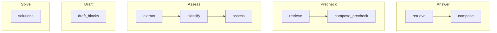

# AGENTS – Node Semantics

This document describes the internal agents (graph nodes) that orchestrate
RAG/LLM workflows. Each node accepts a structured input, applies **PII masking**
before invoking the LLM client, and produces a structured output including a
`gaps` list when insufficient context is available (*no‑info fallback*).
All textual outputs should reference citations when possible.

## Graphs

```
answer   : retrieve -> compose
precheck : retrieve -> compose_precheck
assess   : extract -> classify -> assess
draft    : draft_blocks (prompt selected by type)
solve    : solutions
```



## Node Overview

| Node | Input | Output | LLM Label | Notes |
| --- | --- | --- | --- | --- |
| `retrieve` | `query: str` | `chunks: list[str], gaps: list[str]` | `simple-query` | returns context snippets |
| `compose` | `chunks: list[str]` | `text: str, citations: list, gaps: list[str]` | `synthesize` | builds final answer |
| `extract` | `text: str` | `items: list, gaps: list[str]` | `extract` | pulls structured items |
| `classify` | `items: list` | `labels: list, gaps: list[str]` | `classify` | yes|no|unsure |
| `assess` | `labels: list` | `risk: str, gaps: list[str]` | `analyze` | evaluates risk |
| `draft_blocks` | `type: str, inputs: any` | `blocks: list, gaps: list[str]` | `draft` | type selects prompt |
| `solutions` | `issue: str` | `solutions: list, gaps: list[str]` | `analyze` | suggests options |
| `compose_precheck` | `chunks: list[str]` | `score: int, gaps: list[str]` | `analyze` | lightweight evaluation |

All nodes return `prompt_version` in addition to the fields above.

## PII and Logging Order

1. Load prompt via `load_prompt` to obtain text and version
2. Mask text using `pii.mask`
3. Call `llm.call` with appropriate **label**
4. Log metadata through the Langfuse tracing decorator

Logs and ledger entries must contain only masked content.

## Citation Requirement

When source documents are used, output responses MUST include citation
references. If no sources exist, an empty `gaps` entry explains missing
information instead of hallucinating answers.

