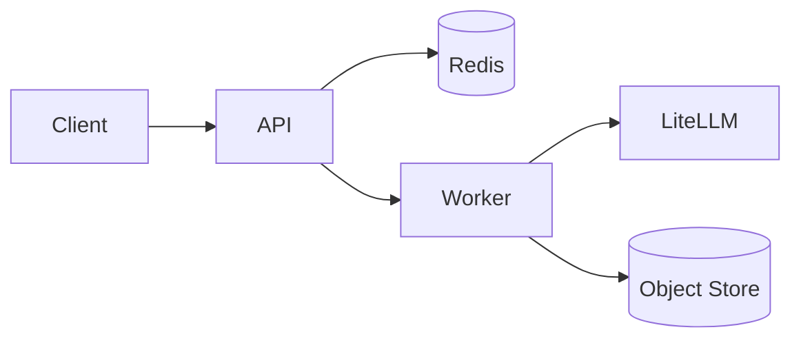

# AI Core MVP

Infrastructure scaffold for running Retrieval Augmented Generation and LLM‑
based workflows in the context of **BetrVG Mitbestimmung**. The project keeps
all components lightweight and avoids a database to demonstrate service
integration, observability, and prompt versioning.

## Architecture Overview

The stack consists of:

- **API service** exposing synchronous endpoints
- **Worker service** executing a Celery task chain for ingestion
- **Redis** for rate limiting and task broker
- **Filesystem object store** under `.objstore/`
- **LiteLLM** proxy accessed via label routing

Orchestrator graphs coordinate stub nodes that call the LLM client with
placeholders and return structured responses with `gaps` to indicate missing
context.



## Endpoints

| Method & Path | Description |
| --- | --- |
| `GET /health` | Basic liveness check |
| `POST /ingest` | Queue document ingestion chain |
| `POST /answer` | Retrieve & compose answer with citations |
| `POST /precheck` | Minimal retrieval and scoring |
| `POST /assess` | Extract → classify → assess risk |
| `POST /draft` | Generate draft blocks (`system`, `functions`, `clauses`) |
| `POST /solve` | Suggest solution options |

All requests require `X-Tenant-ID` and `X-Case-ID` headers. Responses include
`x-trace-id` and `x-prompt-version` for observability.

## Environment Variables

| Variable | Purpose |
| --- | --- |
| `LITELLM_BASE_URL` | Base URL of the LiteLLM proxy |
| `REDIS_URL` | Redis connection string for rate limiting & Celery |
| `S3_*` | Optional parameters for external object storage |
| `LANGFUSE_*` | Optional tracing keys passed through to the logger |

## Getting Started

```bash
cd ai-core
docker compose -f docker/docker-compose.yml up --build
```

Example requests:

```bash
curl -s -D - \
  -H "X-Tenant-ID: t1" \
  -H "X-Case-ID: c1" \
  -H "Content-Type: application/json" \
  -d '{"question":"hi"}' \
  http://localhost:8000/answer

curl -s -D - \
  -H "X-Tenant-ID: t1" \
  -H "X-Case-ID: c1" \
  -H "Content-Type: application/json" \
  -d '{"context":"sample"}' \
  http://localhost:8000/precheck
```

See [CONTRIBUTING.md](CONTRIBUTING.md) for development loops and
[AGENTS.md](AGENTS.md) for node semantics.

## Security Principles

- Mandatory tenant & case headers on every request
- PII masking applied to logs and all LLM prompts
- Per‑tenant token bucket rate limiting
- Object store paths scoped to `{tenant}/{case}`

## Limitations

- In‑memory vector search; no persistence or real embedding
- LLM calls hit a stub endpoint; no actual models
- Minimal validation and error handling
- Not production ready; for demonstration only

