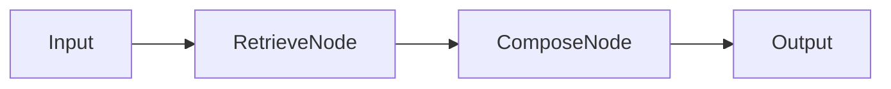

# Agent Architecture Overview

This document outlines the architecture of agents in NOESIS 2, specifically focusing on the `RetrievalAugmentedGenerationGraph` and `ExternalKnowledgeGraph`.

## Core Concepts

Agents are implemented as graphs (using LangGraph concepts) that orchestrate the flow of data between:

1. **Nodes**: Functional units (e.g., Retrieval, Composition, Web Search).
2. **Workers**: Specialized tools (e.g., `WebSearchWorker`).
3. **LLMs**: Language models for reasoning and generation.

## Graphs

### 1. Retrieval Augmented Generation (RAG)

**Location**: [`ai_core/graphs/retrieval_augmented_generation.py`](../../ai_core/graphs/retrieval_augmented_generation.py)

This graph implements the standard RAG flow:

1. **Retrieve**: Fetches relevant documents using `RetrieveNode` (implemented by `retrieve.run`).
2. **Compose**: Generates an answer using `ComposeNode` (implemented by `compose.run`).

**Flow**:

### 2. External Knowledge Graph

**Location**: [`ai_core/graphs/external_knowledge_graph.py`](../../ai_core/graphs/external_knowledge_graph.py)

This graph handles web search, result filtering, and optional Human-In-The-Loop (HITL) review.

**Nodes**:

* `_k_search`: Executes web search using `WebSearchWorker`.
* `_k_filter_and_select`: Filters results and selects the best candidate.
* `_k_hitl_gate`: Manages manual review if enabled.
* `_k_trigger_ingestion`: Triggers ingestion of selected content.

### 3. Hybrid Search & Score

**Location**: [`llm_worker/graphs/hybrid_search_and_score.py`](../../llm_worker/graphs/hybrid_search_and_score.py)

This graph (running in `llm_worker`) performs advanced reranking of search results using RRF (Reciprocal Rank Fusion) and LLM scoring.

## Contracts

* **Tool Contracts**: Defines the envelope for tool inputs/outputs (`ToolContext`, `ToolResult`). See [Tool Contracts](./tool-contracts.md).
* **Reranking Contracts**: Defines data structures for reranking (`ScoringContext`, `HybridResult`). See [Reranking Contracts](./reranking-contracts.md).
* **Web Search**: Defines `WebSearchWorker` interfaces. See [Web Search Tool](./web-search-tool.md).

## Tenancy & Context

Agents and tools run inside a strict context contract defined by `ScopeContext`/`ToolContext` and shared across APIs, graphs and services:

- **tenant_id**: Mandatory in every request; selects schema, permissions and data room for the organizational tenant.
- **case_id**: Stable identifier for a business case within a tenant; bundles workflows, documents, context and decisions for the entire lifetime and must be present on every case-related graph execution.
- **workflow_id**: Labels the logical workflow inside a case (e.g., intake, assessment, document generation); remains constant across multiple executions and should be provided by the caller or dispatcher, not by the graph itself.
- **run_id**: Technical runtime identifier for a single LangGraph execution; each run creates a new, non-semantic ID that belongs to exactly one `workflow_id` and `case_id` and is regenerated per execution.

Relationship: Tenant → many Cases → many Workflows → many Runs. Tool calls always include `tenant_id`, `trace_id`, `invocation_id` plus exactly one runtime ID (`run_id` or `ingestion_run_id`). Graphs set `case_id` and `workflow_id` as soon as the business context is known, while `run_id` stays purely technical and is issued per execution.

## Observability

Tracing is integrated via `ai_core.infra.observability`. Spans are recorded for graph executions, node transitions, and tool calls.
