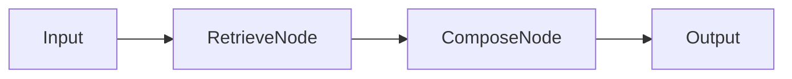
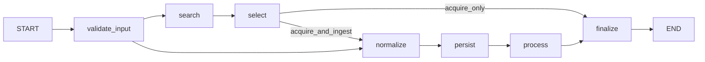

# Agent Architecture Overview

This document outlines the architecture of agents in NOESIS 2, specifically focusing on the active graphs and their relationships.

## Core Concepts

Agents are implemented as graphs (using LangGraph concepts) that orchestrate the flow of data between:

1. **Nodes**: Functional units (e.g., Retrieval, Composition, Web Search).
2. **Workers**: Specialized tools (e.g., `WebSearchWorker`).
3. **LLMs**: Language models for reasoning and generation.

## Canonical Graph Map

This table defines the **current, active graphs** in NOESIS 2. Any graph not listed here is either deprecated or a historical reference only.

| Graph | Purpose | Status | Code Path | Layer |
|-------|---------|--------|-----------|-------|
| `universal_ingestion_graph` | Document persistence + RAG indexing primitive | Active | `ai_core/graphs/technical/universal_ingestion_graph.py` | Technical (L3) |
| `web_acquisition_graph` | Web search acquisition | Active | `ai_core/graphs/web_acquisition_graph.py` | Technical (L3) |
| `retrieval_augmented_generation` | RAG query flow (retrieve -> compose) | Active | `ai_core/graphs/technical/retrieval_augmented_generation.py` | Technical (L3) |
| `collection_search` | Business orchestration: search + optional ingestion | Active | `ai_core/graphs/technical/collection_search.py` | Business/Tech Hybrid |
| `framework_analysis_graph` | Framework agreement analysis (KBV/GBV) | Active | `ai_core/graphs/business/framework_analysis_graph.py` | Business (L2) |
| `document_service` | Document operations | Active | `ai_core/graphs/technical/document_service.py` | Technical (L3) |
| `cost_tracking` | Cost tracking | Active | `ai_core/graphs/technical/cost_tracking.py` | Technical (L3) |
| `info_intake` | Legacy info intake | Deprecated | `ai_core/graphs/technical/info_intake.py` | Technical (L3) |
| `ExternalKnowledgeGraph` | Old search integration concept | Never Implemented | N/A | Historical |
| `upload_ingestion_graph` | Old upload ingestion | Removed | N/A | Historical |
| `crawler_ingestion_graph` | Old crawler ingestion | Removed | N/A | Historical |


### Graph Relationships

```
Business Layer (L2):
- framework_analysis_graph (domain-specific)
- collection_search (orchestration) -> delegates to technical primitives

Technical Primitives (L3):
- universal_ingestion_graph (persistence + RAG) -> used by: Upload UI, Crawler, Collection Search
- web_acquisition_graph (search acquisition) -> used by: Collection Search (quick search mode)
- retrieval_augmented_generation (RAG query) -> used by: Chat/Workbench, Collection Search
```

### Entry Points by Use Case

- **Document Upload**: `universal_ingestion_graph`
- **Crawler Ingestion**: `universal_ingestion_graph`
- **Web Search (Quick)**: `web_acquisition_graph`
- **Collection Search**: `collection_search` -> delegates to above
- **RAG Query**: `retrieval_augmented_generation`
- **Framework Analysis**: `framework_analysis_graph`

## Graphs

### 1. Retrieval Augmented Generation (RAG)

**Location**: [`ai_core/graphs/technical/retrieval_augmented_generation.py`](../../ai_core/graphs/technical/retrieval_augmented_generation.py)

This graph implements the standard RAG flow:

1. **Retrieve**: Fetches relevant documents using `RetrieveNode` (implemented by `retrieve.run`).
2. **Compose**: Generates an answer using `ComposeNode` (implemented by `compose.run`).

**Flow**:



### 2. Universal Ingestion Graph (Unified Technical Graph)

**Location**: [`ai_core/graphs/technical/universal_ingestion_graph.py`](../../ai_core/graphs/technical/universal_ingestion_graph.py)

This graph is a **shared ingestion primitive** for **Upload**, **Crawler**, and delegated **Web Search** ingestion. It handles document persistence and RAG indexing after acquisition. For web search acquisition itself, see `web_acquisition_graph`; for business orchestration, see `collection_search`.

**Flow**:



**Capabilities**:

* **Source**: `upload`, `crawler`, `search`
* **Modes**: `ingest_only`, `acquire_only`, `acquire_and_ingest`
* **Search Integration**: Supports quick search (`acquire_only`) and staged ingestion (`acquire_and_ingest`).

**Output Contract**:

The graph returns a `UniversalIngestionOutput` containing:

* `decision`: `ingested`, `acquired`, `skipped`, or `error`
* `document_id`: UUID (if persisted)
* `transitions`: List of executed nodes (dynamic based on path)
* `telemetry`: Standardized context

### 3. Hybrid Search & Score

**Location**: [`llm_worker/graphs/hybrid_search_and_score.py`](../../llm_worker/graphs/hybrid_search_and_score.py)

This graph (running in `llm_worker`) performs advanced reranking of search results using RRF (Reciprocal Rank Fusion) and LLM scoring.

## Contracts

* **Tool Contracts**: Defines the envelope for tool inputs/outputs (`ToolContext`, `ToolResult`). See [Tool Contracts](./tool-contracts.md).
* **Reranking Contracts**: Defines data structures for reranking (`ScoringContext`, `HybridResult`). See [Reranking Contracts](./reranking-contracts.md).
* **Web Search**: Defines `WebSearchWorker` interfaces. See [Web Search Tool](./web-search-tool.md).

## Tenancy & Context

Agents and tools run inside a strict context contract defined by `ScopeContext`/`BusinessContext`/`ToolContext` and shared across APIs, graphs, and services:

* **tenant_id**: Mandatory in every request; selects schema, permissions and data room for the organizational tenant.
* **case_id**: Stable identifier for a business case within a tenant; bundles workflows, documents, context and decisions for the entire lifetime and must be present on every case-related graph execution.
* **workflow_id**: Labels the logical workflow inside a case (e.g., intake, assessment, document generation); remains constant across multiple executions and should be provided by the caller or dispatcher, not by the graph itself.
* **run_id**: Technical runtime identifier for a single LangGraph execution; each run creates a new, non-semantic ID and is regenerated per execution.

Relationship: Tenant -> many Cases -> many Workflows -> many Runs. Tool calls always
include `tenant_id`, `trace_id`, `invocation_id` plus at least one runtime ID
(`run_id` and/or `ingestion_run_id`). Graphs set `case_id` and `workflow_id` as
soon as the business context is known, while `run_id` stays purely technical and
is issued per execution.

## Observability

Tracing is integrated via `ai_core.infra.observability`. Spans are recorded for graph executions, node transitions, and tool calls.
