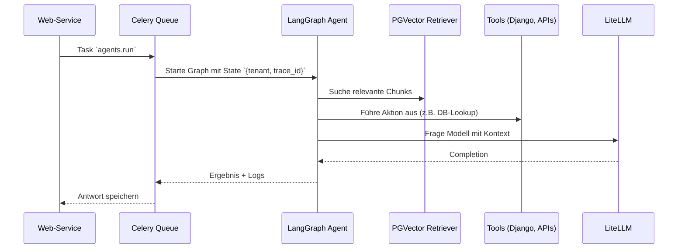

# Warum
Agenten orchestrieren den Zugriff auf Retrieval und Aktionen. Diese Übersicht erklärt, wie LangGraph eingebettet wird, welche Guardrails gelten und wie Requests aus der Web-App verarbeitet werden.

# Wie
## Kontrollfluss

Jeder Aufruf muss die Header `X-Tenant-ID`, `X-Case-ID` und `Idempotency-Key` setzen. Die Werte werden in `meta` übernommen, sodass der Graph tenant-spezifisch arbeitet und doppelte POSTs anhand des `Idempotency-Key` ignorieren kann.

## Knoten und Guardrails
| Node | Aufgabe | Guardrail |
| --- | --- | --- |
| RetrievalNode | Ruft `pgvector` über LangChain Retriever | Erzwingt `tenant_id` Filter, max 5 Ergebnisse |
| ReasonNode | Bewertet Ergebnisse, entscheidet nächsten Schritt | Bricht ab, wenn keine Treffer (`fallback=true`) |
| ActNode | Führt Tools aus (z.B. Django Services) | Timeout 30s, idempotente Aufrufe |
| LLMNode | Sendet Prompt an LiteLLM | Verwendet `prompt_version` aus Config, maskiert PII |

Agenten sind plattformweit; keine tenantspezifischen Prompts oder Tools im Startzustand. Tenancy greift ausschließlich im Retriever-Filter, `prompt_version` wird zentral in der Plattformkonfiguration gepflegt.

## Tools, Cancellations und Tests
- Tools definieren sich als LangChain-Tools mit klarer Input/Output-Spezifikation; Beispiele: `fetch_case`, `update_status`.
- Cancellation: Jeder Node prüft `state["cancel"]`; falls gesetzt, beendet der Graph ohne weitere LLM-Calls.
- Fehler propagieren als `AgentError` und landen in Langfuse mit Trace-Tags `error_type`/`tenant_id`.
- Tests: Unit-Tests simulieren Nodes mit `FakeRetriever`, Integrationstests laufen über Docker Compose inklusive LiteLLM Stub; E2E (siehe [Pipeline](../cicd/pipeline.md)) ruft den Agentenpfad vollständig.

# Schritte
1. Implementiere Nodes gemäß Tabelle und dokumentiere sie mit `prompt_version` und Guardrails.
2. Verdrahte den Web-Aufruf mit Celery Queue `agents` und halte die Tool-Registrierung plattformweit, bevor Deployments erfolgen.
3. Überwache Traces via [Langfuse Observability](../observability/langfuse.md) und aktualisiere Guardrails nach jedem Incident-Review.
