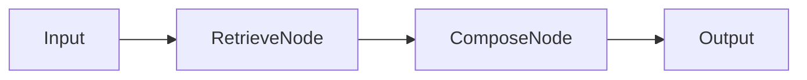
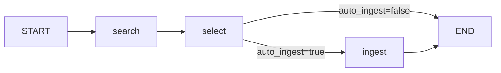

# Agent Architecture Overview

This document outlines the architecture of agents in NOESIS 2, specifically focusing on the `RetrievalAugmentedGenerationGraph` and `ExternalKnowledgeGraph`.

## Core Concepts

Agents are implemented as graphs (using LangGraph concepts) that orchestrate the flow of data between:

1. **Nodes**: Functional units (e.g., Retrieval, Composition, Web Search).
2. **Workers**: Specialized tools (e.g., `WebSearchWorker`).
3. **LLMs**: Language models for reasoning and generation.

## Graphs

### 1. Retrieval Augmented Generation (RAG)

**Location**: [`ai_core/graphs/retrieval_augmented_generation.py`](../../ai_core/graphs/retrieval_augmented_generation.py)

This graph implements the standard RAG flow:

1. **Retrieve**: Fetches relevant documents using `RetrieveNode` (implemented by `retrieve.run`).
2. **Compose**: Generates an answer using `ComposeNode` (implemented by `compose.run`).

**Flow**:

### 2. External Knowledge Graph

**Location**: [`ai_core/graphs/external_knowledge_graph.py`](../../ai_core/graphs/external_knowledge_graph.py)

This graph handles web search, result filtering, selection, and optional automated ingestion of external knowledge sources.

**Flow**:

**Nodes**:

1. **search** (`search_node`): Executes web search using injected `WebSearchWorker`, filters context to allowed telemetry fields (`tenant_id`, `trace_id`, `workflow_id`, `case_id`, `run_id`, `worker_call_id`). Returns `search_results` or `error`.

2. **select** (`selection_node`): Filters and ranks search results:
   - Removes snippets below `min_snippet_length` (default: 40 chars)
   - Blocks domains from `blocked_domains` list
   - Excludes results with `noindex` + `robot` hints
   - Limits to `top_n` candidates (default: 5)
   - Prefers PDF results if `prefer_pdf=true`
   - Selects highest-ranked candidate as `selected_result`

3. **ingest** (`ingestion_node`): Triggers document ingestion for selected URL via injected `IngestionTrigger` protocol. Only invoked if `auto_ingest=true`.

**State Contract (ExternalKnowledgeState)**:

| Field | Type | Required | Description |
|-------|------|----------|-------------|
| `query` | `str` | Yes | Search query |
| `collection_id` | `str` | Yes | Target collection for ingestion |
| `enable_hitl` | `bool` | Yes | HITL flag (reserved for future use) |
| `context` | `dict[str, Any]` | Yes | Tenant ID, Trace ID, runtime dependencies |
| `search_results` | `list[dict[str, Any]]` | Output | Raw search results from worker |
| `selected_result` | `dict[str, Any] \| None` | Output | Best candidate selected |
| `ingestion_result` | `dict[str, Any] \| None` | Output | Ingestion status |
| `error` | `str \| None` | Output | Error message |
| `auto_ingest` | `bool` | Input | Whether to auto-trigger ingestion |

**Runtime Dependencies (Injected via Context)**:

| Dependency | Protocol | Required | Description |
|------------|----------|----------|-------------|
| `runtime_worker` | `WebSearchWorker` | Yes | Web search provider (e.g., Tavily, SerpAPI) |
| `runtime_trigger` | `IngestionTrigger` | No | Ingestion trigger (required if `auto_ingest=true`) |
| `min_snippet_length` | `int` | No | Minimum snippet length (default: 40) |
| `blocked_domains` | `list[str]` | No | Blocked domain list (default: []) |
| `top_n` | `int` | No | Max candidates to shortlist (default: 5) |
| `prefer_pdf` | `bool` | No | Prefer PDF results (default: true) |

**Error Handling**:

- Search failure: `error` set with provider error message, `search_results` empty
- No search worker: `error="No search worker configured in context"`
- No ingestion trigger (when auto_ingest=true): `ingestion_result={"status": "error", "reason": "no_trigger_configured"}`
- Ingestion exception: `ingestion_result={"status": "error", "reason": "<exception>"}`

**HITL Flow (Future)**:

Currently, the graph supports basic HITL signaling via `enable_hitl` flag, but does not pause for human approval. The `_check_hitl` conditional edge determines whether to:
- **auto_ingest=true**: Proceed to ingestion node
- **auto_ingest=false**: Skip ingestion, end with selection only

Future HITL implementation will use LangGraph interrupts to pause execution and await human approval before ingestion.

### 3. Hybrid Search & Score

**Location**: [`llm_worker/graphs/hybrid_search_and_score.py`](../../llm_worker/graphs/hybrid_search_and_score.py)

This graph (running in `llm_worker`) performs advanced reranking of search results using RRF (Reciprocal Rank Fusion) and LLM scoring.

## Contracts

* **Tool Contracts**: Defines the envelope for tool inputs/outputs (`ToolContext`, `ToolResult`). See [Tool Contracts](./tool-contracts.md).
* **Reranking Contracts**: Defines data structures for reranking (`ScoringContext`, `HybridResult`). See [Reranking Contracts](./reranking-contracts.md).
* **Web Search**: Defines `WebSearchWorker` interfaces. See [Web Search Tool](./web-search-tool.md).

## Tenancy & Context

Agents and tools run inside a strict context contract defined by `ScopeContext`/`ToolContext` and shared across APIs, graphs and services:

- **tenant_id**: Mandatory in every request; selects schema, permissions and data room for the organizational tenant.
- **case_id**: Stable identifier for a business case within a tenant; bundles workflows, documents, context and decisions for the entire lifetime and must be present on every case-related graph execution.
- **workflow_id**: Labels the logical workflow inside a case (e.g., intake, assessment, document generation); remains constant across multiple executions and should be provided by the caller or dispatcher, not by the graph itself.
- **run_id**: Technical runtime identifier for a single LangGraph execution; each run creates a new, non-semantic ID that belongs to exactly one `workflow_id` and `case_id` and is regenerated per execution.

Relationship: Tenant → many Cases → many Workflows → many Runs. Tool calls always include `tenant_id`, `trace_id`, `invocation_id` plus exactly one runtime ID (`run_id` or `ingestion_run_id`). Graphs set `case_id` and `workflow_id` as soon as the business context is known, while `run_id` stays purely technical and is issued per execution.

## Observability

Tracing is integrated via `ai_core.infra.observability`. Spans are recorded for graph executions, node transitions, and tool calls.
