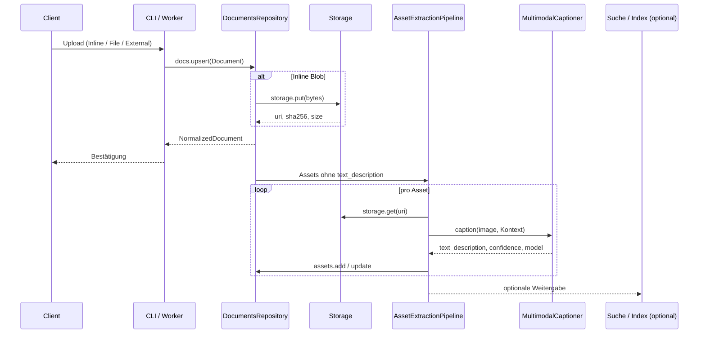
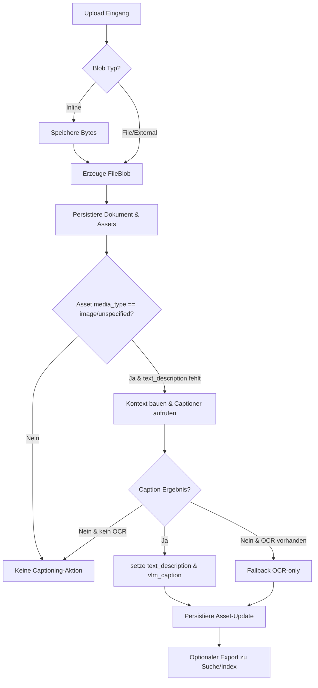

# Documents-Subsystem

## Zweck und Scope
Das Documents-Subsystem verwaltet tenant-isolierte Inhalte von der Aufnahme bis zur Anreicherung. Es kapselt Kontrakte, Persistenz und Hilfsprozesse für Dokumente und Assets und grenzt sich bewusst von RAG-Retrieval, Agentenlaufzeiten und ETL-Strecken ab. Sein Fokus liegt auf sicherem Speichern, Normalisieren und Anreichern von Dokumenten inklusive Bildunterschriften, bevor optionale Downstream-Konsumenten (z. B. Suche oder Vektor-Indexe) aktiv werden.

## End-to-End Sequenz

## Ablaufdiagramm

## Komponentenübersicht
| Komponente | Aufgabe |
| --- | --- |
| Contracts & Utilities | Pydantic-Verträge, Normalisierung (Tenant, Tags, Media-Type, BBox). |
| Repository | Mandantenisolierte Persistenz, Cursor-gestützte Listen, Versionen. |
| Storage | Binärablage (In-Memory Adapter als Referenz). |
| CLI | Bedienung und Smoke-Tests ohne Web-API. |
| Logging & Observability | Strukturierte Logs, Metriken, Spans entlang aller Operationen. |
| Captioner | Schnittstelle für deterministische multimodale Beschriftung. |
| AssetExtractionPipeline | Orchestriert Captioning, OCR-Fallbacks und Batch-Verarbeitung. |
| Tests & Beispiele | Validierungs- und Szenario-Suites für Verträge, Repository, CLI und Pipeline. |
| Dokumentation | Observability-Guides und dieser Architekturabriss. |

## Lebenszyklus eines Dokuments
1. **Upload**: Dokument kommt als Inline-, Datei- oder External-Blob an. Tenant-ID und optionale Version identifizieren das Objekt.
2. **Normalisierung**: Eingaben werden über Utilities auf zulässige Längen, Formate und Tags gebracht. Inline-Blobs werden zu FileBlobs materialisiert.
3. **Persistenz**: Repository speichert Dokument samt Assets, erzwingt Mandantenisolation und verwaltet Soft- bzw. Hard-Deletes.
4. **Anreicherung**: Bild-Assets ohne Beschreibung werden über die Pipeline verarbeitet; Kontext wird byte-sicher begrenzt, Captioner liefert Modelle und Konfidenz.
5. **Fallbacks**: Fehlen Caption-Ergebnisse, nutzt die Pipeline OCR-Texte oder markiert Assets als nicht captionierbar.
6. **Weitergabe**: Optional können externe Systeme (Suche, Indexer) das normalisierte Dokument konsumieren.
7. **Aktualisierung**: Neue Versionen desselben Dokumentes werden idempotent upserted; Cursor erlauben paginierte Abfragen.
8. **Löschung**: Soft-Deletes blenden Dokumente aus, Hard-Deletes entfernen Binärpayloads. Alle Pfade protokollieren Observability-Telemetrie.

## Glossar
| Begriff | Beschreibung |
| --- | --- |
| DocumentRef | Identifiziert Dokumente über tenant_id, document_id, optionale collection_id und version. |
| NormalizedDocument | Vollständiger Contract aus Referenz, Metadaten, Blob und Assets. |
| DocumentMeta | Beschreibt Titel, Sprache, Tags, Ursprüngliche Quellen und externe Referenzen. |
| BlobLocator | Union für Inline-, Datei- und External-Blobs inklusive SHA-Checksummen. |
| FileBlob | Persistierter Blob mit URI, SHA256 und Größe. |
| InlineBlob | Base64-kodiertes Payload, das beim Persistieren materialisiert wird. |
| ExternalBlob | Verweis auf externe Speicher (http/https, s3, gcs). |
| AssetRef | Tenant-konformer Zeiger auf Asset und zugehöriges Dokument. |
| Asset | Medienspezifisches Element (z. B. Bild) mit Kontext, Bounding Box und Caption. |
| text_description | Semantische Kurzbeschreibung eines Assets, begrenzt auf 2048 Bytes. |
| caption_method | Kennzeichnet die Quelle der Beschreibung (vlm_caption, ocr_only, manual, none). |
| AssetExtractionPipeline | Prozess, der Bild-Assets captioniert und Fallbacks steuert. |
| MultimodalCaptioner | Interface für Caption-Modelle, liefert Text, Confidence und Modellnamen. |
| Storage Adapter | Kapselt Binär-Ablage, hier als Memory-Implementierung. |
| DocumentsRepository | Schnittstelle für Upserts, Lesungen, Listen und Löschungen. |

## Weiterführende Hinweise
- Downstream-RAG und Agenten nutzen NormalizedDocument- und Asset-Outputs, werden jedoch separat orchestriert.
- Policies für Medien-Typen, Checksummen und Mandantenzugriff sind zentral im Contracts- und Repository-Layer verankert.
