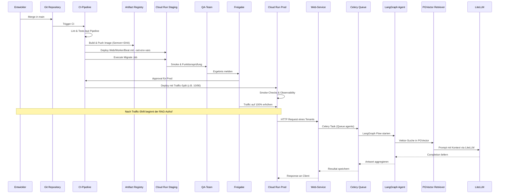

# Warum

Die Architekturübersicht schafft ein gemeinsames Verständnis für alle Container- und Cloud-Bausteine. Sie erklärt, wie Web-App, Hintergrundjobs und LiteLLM zusammenspielen und welche Infrastruktur in den verschiedenen Umgebungen benötigt wird.

# Wie

## Systemkontext

Die Plattform besteht aus einer Django-Anwendung mit Mehrmandantenfähigkeit, unterstützt von Celery für asynchrone Aufgaben, einem RAG-Stack und LiteLLM als Proxy für Sprachmodelle. Die Hauptkomponenten sind:

- **Web-Service**: Django via Gunicorn für HTTP-Traffic und Admin-Interface.
- **Worker-Service**: Celery Worker für Standardaufgaben (`celery` Queue).
- **Ingestion-Worker**: Dedizierte Celery Queue (`ingestion`) für Datenaufnahme und Embedding-Erstellung, siehe [RAG-Ingestion](../rag/ingestion.md).
- **Agents-Worker**: Dedizierte Celery Queue (`agents`) für LangGraph-Agenten, orchestriert Retrieval und Aktionen, beschrieben in [Agenten-Übersicht](../agents/overview.md).
- **Beat-Service (optional)**: Celery Beat oder Scheduler für periodische Jobs (in Dev/Prod optional).
- **Migrate-Job**: Separater Containerlauf, führt `manage.py migrate_schemas --shared` und `--tenant` aus.
- **LiteLLM-Service**: Proxy mit Admin-GUI, gesichert über Master Key laut [`config/litellm-config.yaml`](../../config/litellm-config.yaml).
- **RAG Store**: `pgvector`-Schema in Cloud SQL mit Tabellen laut [RAG-Schema](../rag/schema.sql).

## Laufzeitpfade

| Umgebung | Bereitstellungspfad | Netzpfad |
| --- | --- | --- |
| Dev lokal | `docker-compose.dev.yml` startet Web, Worker, Agents-Worker, Ingestion-Worker, LiteLLM, Postgres, Redis | Docker-Bridge, direkte Container-Kommunikation |
| Staging GCP | CI veröffentlicht Images nach Artifact Registry und deployt Cloud Run Dienste laut [Pipeline](../cicd/pipeline.md) | Öffentliche Cloud Run Endpunkte, Cloud SQL Connector (Public IP), Serverless VPC Access zu Memorystore |
| Prod GCP | Genehmigter Release nutzt Traffic-Split auf Cloud Run | Interne Cloud Run Dienste hinter HTTPS Load Balancer, Private Service Connect zu Cloud SQL, Serverless VPC Access |

## Komponenten und Abhängigkeiten

```mermaid
graph TD
    subgraph Client
        U[Benutzer]
    end
    subgraph Edge
        LB[HTTPS Load Balancer]
    end
    subgraph CloudRun[Cloud Run Dienste]
        W[Web (Gunicorn)]
        C[Worker (Celery Core)]
        I[Ingestion-Worker (Celery)]
        A[Agents-Worker (Celery)]
        B[Beat / Scheduler]
        J[Migrate Job]
        L[LiteLLM Admin GUI]
    end
    subgraph Daten
        SQL[(Cloud SQL Postgres)]
        RAG[(RAG Store - pgvector Schema)]
        Redis[(Memorystore Redis)]
    end
    subgraph Integrationen
        AR[(Artifact Registry)]
        SM[(Secret Manager - Prod)]
        VPC[Serverless VPC Connector]
    end

    U --> LB
    LB --> W
    W --> SQL
    W --> Redis
    W --> L
    W --> A
    C --> Redis
    C --> SQL
    I --> Redis
    I --> RAG
    A --> Redis
    A --> RAG
    B --> Redis
    J --> SQL
    J --> Redis
    L --> SQL
    W -.-> AR
    C -.-> AR
    B -.-> AR
    J -.-> AR
    L -.-> AR
    W -.-> SM
    C -.-> SM
    B -.-> SM
    J -.-> SM
    L -.-> SM
    W --> VPC
    C --> VPC
    B --> VPC
    J --> VPC
    L --> VPC
```

## Deploy- und RAG-Flow



## Datenpfade und Tenancy

| Umgebung | Applikationsdaten | RAG Store | Tenancy-Modell |
| --- | --- | --- | --- |
| Dev lokal | PostgreSQL Container mit gemeinsamem Schema für alle Entwickler | Gleiches Container-Postgres mit aktivierter `pgvector`-Extension | Tenants über Schema `public` simuliert; zusätzliche Schemas optional per `manage.py create_tenant` |
| Staging GCP | Cloud SQL Public IP, Django nutzt Schema je Tenant | Cloud SQL `pgvector`-Schema im selben Instance; Extension aktiviert, isoliert per Schema-Namen | Multi-Tenant über separate Schemas für Kern-Daten, PGVector nutzt `tenant_id` Spalte laut [RAG-Schema](../rag/schema.sql) |
| Prod GCP | Cloud SQL Private IP, getrennte DB für App und LiteLLM möglich | Cloud SQL `pgvector`-Schema mit Private IP, Indexierung IVFFLAT/HNSW | Entweder Schema pro Mandant oder `tenant_id` + RLS (siehe [Prod Leitfaden](../cloud/gcp-prod.md)) |

Standardmäßig planen wir mit höchstens 50 Tenants. Steigt die Anzahl, skalieren wir horizontal auf weitere Datenbank-Instanzen und prüfen optional einen Silo-Betrieb pro Großkunde.

### Kontext-Identitäten im Architekturfluss

- **tenant_id** wählt das Mandanten-Schema, die Berechtigungen und die isolierten Datenräume in Web, Worker, Agents-Worker und Tools; ohne sie werden keine Anfragen verarbeitet.
- **case_id** verankert alle fachlichen Graphläufe eines Mandanten in einem stabilen Vorgang (Dokumente, Entscheidungen, Kontextdaten) und bleibt über die gesamte Lebensdauer unverändert.
- **workflow_id** markiert den logischen Prozessschritt innerhalb eines Cases (z. B. Intake oder Bewertung); sie bleibt bei erneuten Läufen identisch und sollte vom Aufrufer/Dispatcher gesetzt werden, nicht vom Graph selbst.
- **run_id** identifiziert eine konkrete technische Ausführung eines Workflows durch LangGraph; jede Ausführung erzeugt eine neue, nicht fachlich interpretierbare ID und gehört genau zu einer `workflow_id` und `case_id`.

Beziehungsmatrix: Ein Tenant hat viele Cases, ein Case hat viele Workflows, ein Workflow hat viele Runs. Tools benötigen immer `tenant_id`, `trace_id`, `invocation_id` und genau eine Laufzeit-ID (`run_id` oder `ingestion_run_id`); Graphen setzen `case_id` und `workflow_id`, sobald der fachliche Kontext bekannt ist, und generieren `run_id` pro Ausführung strikt technisch.

# Schritte

1. Baue Container nach den [Docker-Konventionen](../docker/conventions.md) und tagge Images deterministisch.
2. Pflege Umgebungsparameter anhand der [Environment-Matrix](../environments/matrix.md), bevor Infrastruktur angelegt wird.
3. Richte Staging- und Produktionsressourcen gemäß den Cloud-Run-Leitfäden ([Staging](../cloud/gcp-staging.md), [Prod](../cloud/gcp-prod.md)) ein.
4. Kopple die CI/CD-Stufen aus der [Pipeline-Dokumentation](../cicd/pipeline.md) mit den benötigten Berechtigungen.
5. Bereite Betriebshandbücher ([Migrationen](../runbooks/migrations.md), [Incidents](../runbooks/incidents.md)) und Skalierungsregeln ([Operations](../operations/scaling.md)) vor, bevor Traffic verschoben wird.
