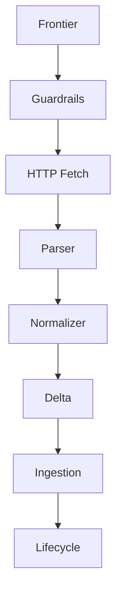

# Crawler – Überblick

Der Crawler übernimmt die kontinuierliche Synchronisation externer Quellen und
liefert normalisierte Dokumente an die RAG-Ingestion. Dieses Dokument fasst
Pipeline, Kernverträge und Betriebsschalter zusammen und orientiert sich am
Aufbau der übrigen App-Dokumentationen.

## Zweck
- Erstellt deterministische Frontier-Entscheidungen auf Basis von Robots-,
  Politeness- und Failure-Signalen, damit Quellen nur dann besucht werden, wenn
  es Policies erlauben und Recrawl-Intervalle eingehalten werden.
- Streamt Inhalte über den HTTP-Fetcher ein, erzwingt Sicherheits-Limits und
  mappt Response-Metadaten in strukturierte Fetch-Ergebnisse.
- Normalisiert Parser-Ausgaben zu konsistenten Dokument-Artefakten, berechnet
  Delta- und Near-Duplicate-Signaturen und liefert Basis-Metadaten an den
  zentralen Dedup-Service. Skip- oder Replace-Entscheidungen erfolgen erst im
  `ai_core.rag.vector_client`.
- Übergibt finale Payloads an die Ingestion, aktualisiert Lifecycle-Timelines
  und emittiert Telemetrie laut [Crawler Observability](../observability/crawler-langfuse.md).

## Pipeline

- **Frontier (`crawler.frontier.decide_frontier_action`)** bewertet Robots,
  Host-Politeness und Recrawl-Signale. Rückgaben wie `enqueue`, `defer`, `skip`
  oder `retire` enthalten Gründe und optionale Policy-Events, um Scheduling und
  Blacklisting nachvollziehbar zu machen.【F:crawler/frontier.py†L14-L122】【F:crawler/frontier.py†L164-L218】
- **Guardrails (`ai_core.api.enforce_guardrails`)** prüfen Host- und
  Tenant-Quoten, MIME-Blacklists sowie Dokumentgrößen, bevor Fetch und Parser
  Ressourcen verbrauchen. Deny-Entscheidungen liefern einen `CrawlerError` mit
  konsistenter Error-Class.【F:ai_core/api.py†L61-L121】【F:ai_core/middleware/guardrails.py†L1-L217】
- **HTTP Fetch (`crawler.http_fetcher.HttpFetcher`)** kapselt Streaming-Fetches
  mit Retry-Policy, Politeness-Delays und Limit-Prüfungen für Bytes, Timeout und
  MIME-Whitelist. Response-Details werden in `FetchResult` und
  `FetchTelemetry` gespiegelt.【F:crawler/http_fetcher.py†L1-L126】【F:crawler/fetcher.py†L1-L119】
- **Parser & Normalizer (`documents.api.normalize_from_raw`)**
  erzeugen `NormalizedDocumentPayload` inklusive Meta-, Content- und
  External-Referenzen. Parser-Statistiken werden für Downstream-Systeme
  konserviert.【F:documents/api.py†L137-L205】【F:documents/normalization.py†L35-L160】
- **Delta (`ai_core.rag.delta.evaluate_delta`)** berechnet Content-Hashes und
  Near-Duplicate-Signaturen, vergleicht Vorgängerversionen und liefert die
  Metadaten an den gemeinsamen Dedup-Service. Skip- oder Replace-Aktionen
  passieren downstream im `vector_client`.【F:ai_core/rag/delta.py†L1-L111】【F:ai_core/rag/vector_client.py†L60-L220】
- **Ingestion (`ai_core.graphs.crawler_ingestion_graph`)** orchestriert Normalisierung,
  Guardrails, Delta-Entscheidungen und Embedding-Trigger über die geteilten Service-APIs.
  Ergebnisse werden als `upsert`, `skip` oder `retire` markiert und enthalten Lifecycle-States
  sowie Policy-Events.【F:ai_core/graphs/crawler_ingestion_graph.py†L1-L211】【F:ai_core/api.py†L123-L247】
- **Lifecycle (`documents.repository.DocumentLifecycleStore`)** verfolgt
  dokumentweite Zustandswechsel zentral und validiert zulässige
  Übergänge. Telemetrie-Attribute werden direkt im Repository persistiert und
  anschließend vom Crawler nur noch weitergereicht.【F:documents/repository.py†L160-L238】

## Kernverträge & Artefakte
| Modul | Verantwortung | Schlüsselklassen |
| --- | --- | --- |
| `crawler.frontier` | Robots-Compliance, Recrawl-Intervalle, Failure-Backoff | `FrontierDecision`, `RobotsPolicy`, `HostPolitenessPolicy` |
| `ai_core.middleware.guardrails` | Tenant/Host-Quoten, MIME- und Host-Blocklisten | `GuardrailLimits`, `GuardrailSignals`, `GuardrailDecision` |
| `crawler.fetcher` | Kanonischer Fetch-Contract inkl. Limits und Telemetrie | `FetchRequest`, `FetchResult`, `FetcherLimits` |
| `crawler.http_fetcher` | Streaming-HTTP-Client mit Retries und User-Agent-Steuerung | `HttpFetcher`, `HttpFetcherConfig`, `FetchRetryPolicy` |
| `documents.api` | Normalisierte Dokumente und Provider-Referenzen | `NormalizedDocumentPayload`, `normalize_from_raw` |
| `ai_core.rag.delta` | Hashing & Near-Duplicate-Detektion | `DeltaDecision`, `DeltaSignatures`, `NearDuplicateSignature` |
| `ai_core.graphs.crawler_ingestion_graph` | Übergabe an RAG-Ingestion & Lifecycle | `CrawlerIngestionGraph`, `GraphTransition` |
| `crawler.errors` | Vereinheitlichtes Fehler-Vokabular | `CrawlerError`, `ErrorClass` |

## Normalisierung & Delta
- Parser-Ergebnisse müssen `ParserContent` liefern; ohne Text wird ein
  `binary_payload_ref` erwartet, ansonsten schlägt die Normalisierung fehl. Das
  garantiert, dass entweder Text oder Binärdaten für Hashing und Ingestion
  vorhanden sind.【F:documents/parsers.py†L120-L214】
- Parser-Statistiken werden in `NormalizedDocumentPayload.document.meta.parse_stats`
  übernommen. Die Normalisierung ergänzt Kennzahlen wie
  `normalizer.bytes_in`, damit Langfuse und Dead-Letter-Payloads denselben
  Zahlenraum teilen.【F:documents/normalization.py†L120-L214】
- Delta-Bewertungen nutzen `ai_core.rag.delta.evaluate_delta` und speichern Content-Hashes sowie
  Near-Duplicate-Signaturen für spätere Vergleiche. Die tatsächliche
  Skip/Replace-Logik liegt im gemeinsamen Dedup-Service (`match_near_duplicate`)
  des Vector-Clients.【F:ai_core/rag/delta.py†L59-L111】【F:ai_core/rag/vector_client.py†L60-L220】

## Ingestion, Retire & Lifecycle
- Der LangGraph `CrawlerIngestionGraph` kombiniert Normalisierung, Delta-Status
  und optionale Lifecycle-Regeln. Statt eigener Payload-Klassen liefert die
  Entscheidung heute ein generisches `Decision`-Objekt mit validiertem
  `ChunkMeta` und artefaktbezogenen Feldern. Retire-Entscheidungen referenzieren
  dieselben Metadaten, sodass Downstream-Systeme ohne Sonderpfad auf die Services
  in `ai_core.api` zugreifen können.【F:ai_core/graphs/crawler_ingestion_graph.py†L40-L210】【F:ai_core/api.py†L123-L247】
- Lifecycle-Updates erfolgen über `documents.api.update_lifecycle_status`, die Persistenz und
  Validierung der Statusübergänge übernimmt `documents.repository`. Dadurch
  entfällt eine lokale Timeline-Implementierung im Crawler, alle Pfade nutzen
  dieselbe Quelle für erlaubte Zustandswechsel.【F:documents/api.py†L226-L273】【F:documents/repository.py†L160-L238】
- Fehler oder Policy-Denies werden über `CrawlerError` in Events gespiegelt und
  nutzen die gemeinsame Error-Class-Taxonomie (`timeout`, `rate_limit`,
  `policy_deny`, …). Das stellt sicher, dass Langfuse und Dead-Letter-Queues
  dieselbe Semantik verwenden.【F:crawler/errors.py†L1-L41】

## Konfiguration & Betriebsschalter
- **User Agent**: `CRAWLER_HTTP_USER_AGENT` kann in Django-Settings oder via
  Environment überschrieben werden. Fallback ist `noesis-crawler/1.0`.【F:noesis2/settings/base.py†L202-L202】【F:crawler/http_fetcher.py†L13-L45】
- **Fetcher Limits**: `FetcherLimits` decken Bytes-Limits, Timeouts und
  MIME-Whitelists ab. Violations werden als Policy-Events zurückgegeben und
  führen zu `FetchStatus.POLICY_DENIED`.【F:crawler/fetcher.py†L69-L119】
- **Retry-Policy**: `FetchRetryPolicy` steuert Anzahl Versuche, Backoff und
  Fehlergründe (HTTP 429/5xx, Netzwerkfehler). Backoff und Jitter sind pro
  Versuch berechenbar und werden in Telemetrie gespiegelt.【F:crawler/http_fetcher.py†L47-L106】
- **Guardrails**: `GuardrailLimits` erlauben Quoten pro Tenant oder Host,
  blocken MIME-Typen/Hosts und begrenzen Prozessdauer sowie Dokumentgröße.
  Überschreitungen erzeugen deterministische Policy-Events.【F:crawler/guardrails.py†L33-L140】【F:crawler/guardrails.py†L170-L232】
- **Recrawl-Intervalle**: `RecrawlFrequency` und `RECRAWL_INTERVALS` definieren
  stündliche bis wöchentliche Frequenzen und berücksichtigen Observed-Change- und
  Manual-Override-Signale.【F:crawler/frontier.py†L55-L115】

## Telemetrie & Fehlerhandhabung
- Alle Stufen liefern `policy_events` und optionale `CrawlerError`-Payloads, die
  direkt in Langfuse-Traces und Dead-Letter-Events übernommen werden. Sie
  korrespondieren mit den Pflichtfeldern aus dem Observability-Leitfaden.【F:crawler/fetcher.py†L121-L152】【F:crawler/ingestion.py†L1-L129】
- `FetchTelemetry` speichert Latenz, Bytes und Retry-Gründe. Die Werte fließen in
  Metrics (`crawler_fetch_latency_ms`, `crawler_fetch_bytes_total`) ein und
  werden von Guardrails genutzt, um Backoff-Strategien zu begründen.【F:crawler/fetcher.py†L81-L119】【F:docs/observability/crawler-langfuse.md†L9-L41】
- Lifecycle-Events werden beim Schreiben über das Repository mit Zeitstempeln
  versehen. Diese Daten fließen unverändert in Observability und SLA-Auswertung
  ein.【F:documents/repository.py†L160-L238】

## Erweiterungshinweise
- Neue Provider sollten `NormalizedSource.provider_tags` und `ExternalDocumentReference`
  nutzen, um kanonische IDs zu übertragen. Zusätzliche Tags werden unverändert an
  die Ingestion übergeben.【F:crawler/normalizer.py†L17-L63】【F:crawler/ingestion.py†L168-L215】
- Weitere Guardrails lassen sich über `GuardrailLimits` erweitern; bei neuen
  Violations immer einen passenden `CrawlerError` mit eindeutiger
  `ErrorClass`-Zuordnung ausgeben.【F:crawler/guardrails.py†L170-L232】【F:crawler/errors.py†L1-L41】
- Für spezialisierte Recrawl-Logik kann `CrawlSignals.override_recrawl_frequency`
  befüllt werden, ohne die Standardintervalle hart zu ändern.【F:crawler/frontier.py†L67-L114】
