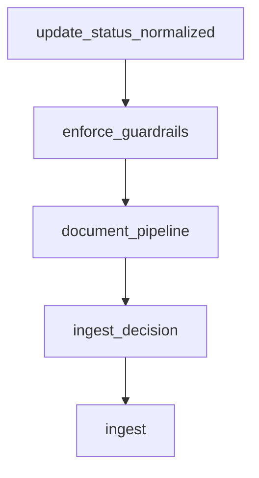

# Crawler – Überblick

Der Crawler übernimmt die kontinuierliche Synchronisation externer Quellen und
liefert normalisierte Dokumente an die RAG-Ingestion. Dieses Dokument fasst
die Graphen, Kernverträge und Betriebsschalter zusammen und orientiert sich am
Aufbau der übrigen App-Dokumentationen.

*Hinweis: Der Begriff „Pipeline“ ist eine historische Bezeichnung für den heute als „Graph“ (LangGraph) bezeichneten Orchestrierungs-Flow.*

## Zweck

- Erstellt deterministische Frontier-Entscheidungen auf Basis von Robots-,
  Politeness- und Failure-Signalen, damit Quellen nur dann besucht werden, wenn
  es Policies erlauben und Recrawl-Intervalle eingehalten werden.【F:crawler/frontier.py†L14-L218】
- Führt Fetches ausschließlich im Worker aus, kapselt Limits und Telemetrie in
  `FetchResult` und übergibt Rohbytes samt Headern direkt an den AI-Core-Task
  `run_ingestion_graph`. Persistenz, Parsing und Lifecycle bleiben komplett im
  AI-Core.【F:crawler/worker.py†L1-L174】
- Der LangGraph orchestriert Guardrails, Normalisierung, Lifecycle und Delta
  über die Documents- und Guardrails-APIs. Follow-up-Aktionen (z. B. Embedding)
  werden nachgelagert ausgelöst und protokolliert.
- Telemetrie und Policy-Events laufen Ende-zu-Ende über Langfuse; der Worker
  liefert dafür nur noch Fetch-Daten und IDs. `ScopeContext` (mit `ingestion_run_id`)
  stellt sicher, dass alle Spans korrekt korreliert werden.

## Architecture Mapping (4-Layer Standard)

Die Crawler-Implementierung folgt strikt der [4-Layer Firm Architecture](../AGENTS.md#firm-architecture-4-layer-standard):

| Layer | Komponente | Beschreibung |
|---|---|---|
| **L1 (Frontend)** | `theme/templates` | HTMX-UI triggert Runs. |
| **L2 (Business)** | `ai_core.views.crawl_selected` | Adapter, validiert Requests und ruft L3 auf. |
| **L3 (Technical)** | `CrawlerManager` | Orchestriert Dispatch an Worker. |
| **L3 (Technical)** | `CrawlerIngestionGraph` | Definiert die Logik des Ingestion-Flows. |
| **L4 (Worker)** | `crawl_url_task` | Führt `CrawlerWorker` (Fetch) aus. |
| **L4 (Worker)** | `run_ingestion_graph` | Führt `CrawlerIngestionGraph` (Ingest) aus. |

## Ingestion-Graph



- **`update_status_normalized`** persistiert den `normalized`-Lifecycle-Status
  im gemeinsamen Dokument-Store, bevor weitere Schritte laufen, und legt das
  Ergebnis als Artefakt für spätere Auswertungen ab.【F:ai_core/graphs/crawler_ingestion_graph.py†L552-L576】
- **`enforce_guardrails`** zieht Limits, Frontier-Kontext und Telemetriedaten
  heran, um Guardrail-Entscheidungen zu treffen, Policy-Events zu sammeln und
  Ablehnungen sofort in Lifecycle und Events zu spiegeln.【F:ai_core/graphs/crawler_ingestion_graph.py†L672-L741】
- **`document_pipeline`** orchestriert Parsing, Chunking und Artefakt-Bildung
  im Dokument-Graph, aktualisiert den Normalized-Payload und synchronisiert den
  `NormalizedDocument` im State für nachgelagerte Entscheidungen.【F:ai_core/graphs/crawler_ingestion_graph.py†L760-L864】
- **`ingest_decision`** kombiniert Delta-Vergleiche, Baseline-Reloads und neue
  Lifecycle-Einträge, um `new/changed/skip`-Entscheide sowie Folgeaktionen zu
  bestimmen.【F:ai_core/graphs/crawler_ingestion_graph.py†L866-L930】
- **`ingest`** triggert Embedding-Aufgaben nur für zulässige Deltas, reichert
  Observability-Spans an und übergibt optionale Upsert-Handler-Ergebnisse an
  das Artefakt-Set.【F:ai_core/graphs/crawler_ingestion_graph.py†L932-L1016】

## Kernverträge & Artefakte

| Modul | Verantwortung | Schlüsselklassen |
| --- | --- | --- |
| `crawler.frontier` | Robots-Compliance, Recrawl-Intervalle, Failure-Backoff | `FrontierDecision`, `RobotsPolicy`, `HostPolitenessPolicy` |
| `crawler.worker` | Fetch & Übergabe an AI-Core Task | `CrawlerWorker`, `WorkerPublishResult` |
| `ai_core.rag.guardrails` | Tenant/Host-Quoten, MIME- und Host-Blocklisten | `GuardrailLimits`, `GuardrailSignals`, `QuotaLimits` |
| `crawler.fetcher` | Kanonischer Fetch-Contract inkl. Limits und Telemetrie | `FetchRequest`, `FetchResult`, `FetcherLimits` |
| `crawler.http_fetcher` | Streaming-HTTP-Client mit Retries und User-Agent-Steuerung | `HttpFetcher`, `HttpFetcherConfig`, `FetchRetryPolicy` |
| `documents.api` | Normalisierte Dokumente und Provider-Referenzen | `NormalizedDocumentPayload`, `normalize_from_raw` |
| `documents.processing_graph` | LangGraph-Orchestrierung von Parsing, Chunking und Artefakt-Phasen | `DocumentProcessingPhase`, `DocumentProcessingState`, `build_document_processing_graph` |
| `documents.pipeline` | Graph-Konfiguration, Kontext und Statusübergänge | `DocumentPipelineConfig`, `DocumentProcessingMetadata`, `DocumentProcessingContext` |
| `ai_core.rag.delta` | Hashing & Near-Duplicate-Detektion | `DeltaDecision`, `DeltaSignatures`, `NearDuplicateSignature` |
| `ai_core.api` | Guardrail-Auswertung, Delta-Entscheidungen & API-Brücke zum Graph | `enforce_guardrails`, `decide_delta`, `trigger_embedding` |
| `ai_core.rag.ingestion_contracts` | Vektor-Payloads & Metadaten | [`CrawlerIngestionPayload`](#crawleringestionpayload), [`ChunkMeta`](#chunkmeta) |
| `ai_core.schemas` | Run-Requests & Origins | [`CrawlerRunRequest`](#crawlerrunrequest), [`CrawlerOriginConfig`](#crawleroriginconfig), [`CrawlerSnapshotOptions`](#crawlersnapshotoptions), [`CrawlerRunLimits`](#crawlerrunlimits) |
| `ai_core.graphs.crawler_ingestion_graph` | Übergabe an RAG-Ingestion & Lifecycle | `CrawlerIngestionGraph`, `GraphTransition` |
| `crawler.errors` | Vereinheitlichtes Fehler-Vokabular | `CrawlerError`, `ErrorClass` |

## Payload- und Run-Verträge

Die folgenden Abschnitte dokumentieren die AI-Core-Verträge, die der Crawler
beim Übergang in die RAG-Ingestion befüllt. Die Inhalte sind referenzierbar aus
anderen RAG-Dokumenten und ersetzen lokale Kopien der Schemas.

### CrawlerIngestionPayload {#crawleringestionpayload}

`CrawlerIngestionPayload` kapselt den finalen Entscheid eines Crawl-Laufs und
wird unverändert an den Vector-Client weitergereicht. Das Modell ist
`frozen=True` und `extra="forbid"`, sodass nach Validierung keine Felder mehr
geändert werden können und unbekannte Keys zu einem Pydantic-Fehler
`extra_forbidden` führen.

#### Felder

| Feld | Zweck | Datentyp | Default | Validierung | Fehlercodes |
| --- | --- | --- | --- | --- | --- |
| `action` | Entscheidung für Upsert/Skip/Retire | `IngestionAction` (`"upsert"\|"skip"\|"retire"`) | – | Enum-Validierung durch Pydantic | `value_error.enum` |
| `lifecycle_state` | Zielstatus für Dokument-Lifecycle | `str` | – | Pflichtfeld, Trim nicht automatisch | Standard `type_error.str` |
| `policy_events` | Telemetrie zu Guardrail/Policy-Verstößen | `tuple[str, ...]` | `()` | Tuple wird eingefroren | `type_error.tuple` |
| `adapter_metadata` | Durchgereichte Kontextdaten des Adapters | `Mapping[str, object]` | – | Muss Mapping sein, keine Mutation mehr nach Konstruktion | `type_error.mapping` |
| `document_id` | Referenz auf das normalisierte Dokument | `str` | – | Pflichtfeld | `type_error.str` |
| `workflow_id` | LangGraph-Workflow, falls vorhanden | `str \| None` | `None` | Optional, wird unverändert übernommen | – |
| `tenant_id` | Mandantenkontext für nachgelagerte Systeme | `str` | – | Pflichtfeld | `type_error.str` |
| `case_id` | Fallkontext für Observability/Tracing | `str \| None` | `None` | Optional | `type_error.str` |
| `content_hash` | Hash des Inhalts für Delta-Entscheide | `str \| None` | `None` | Optional | – |
| `chunk_meta` | Metadaten für Embedding-Storage | [`ChunkMeta`](#chunkmeta) \| `None` | `None` | Nested-Validierung | Fehler aus `ChunkMeta` |
| `embedding_profile` | Angefragtes Embedding-Profil | `str \| None` | `None` | Optional; Muss zu `resolve_ingestion_profile` passen | `INGEST_PROFILE_*` (über `InputError`), `type_error.str` |
| `vector_space_id` | Ziel-Vector-Space | `str \| None` | `None` | Optional; in Kombination mit Profil genutzt | `INGEST_VECTOR_SPACE_UNKNOWN` |
| `delta_status` | Ergebnis des Delta-Vergleichs (`new`, `changed`, `skip`) | `str \| None` | `None` | Optional | – |
| `content_raw` | Ursprünglicher Textinhalt | `str \| None` | `None` | Optional | – |
| `content_normalized` | Normalisierter Textinhalt | `str \| None` | `None` | Optional | – |

> **Hinweis:** Fehlercodes stammen aus `IngestionContractErrorCode` und werden
über `InputError` geworfen, wenn z. B. `embedding_profile` aufgelöst wird.

#### Beispiele

**Upsert mit Chunk-Metadaten**

```json
{
  "action": "upsert",
  "lifecycle_state": "normalized",
  "policy_events": ["guardrail.quota.ok"],
  "adapter_metadata": {"source": "crawler"},
  "document_id": "4f932d53-5b42-4cb6-a820-bf934d947b85",
  "tenant_id": "5f27f1e7-96e2-4c2f-8b7b-1df7f7e15c7a",
  "content_hash": "sha256:abc123",
  "chunk_meta": {
    "tenant_id": "5f27f1e7-96e2-4c2f-8b7b-1df7f7e15c7a",
    "source": "crawler",
    "hash": "chunk:1",
    "external_id": "https://example.com/article",
    "content_hash": "sha256:abc123",
    "embedding_profile": "default-text",
    "vector_space_id": "vs_text_default",
    "process": "knowledge-base"
  },
  "embedding_profile": "default-text",
  "vector_space_id": "vs_text_default",
  "delta_status": "changed",
  "content_normalized": "…"
}
```

**Skip ohne Chunk-Daten**

```json
{
  "action": "skip",
  "lifecycle_state": "normalized",
  "policy_events": ["delta.skip.unchanged"],
  "adapter_metadata": {"source": "crawler"},
  "document_id": "4f932d53-5b42-4cb6-a820-bf934d947b85",
  "tenant_id": "5f27f1e7-96e2-4c2f-8b7b-1df7f7e15c7a",
  "delta_status": "skip"
}
```

**Retire mit Lifecycle-Wechsel**

```json
{
  "action": "retire",
  "lifecycle_state": "retired",
  "policy_events": ["delta.retire.replaced"],
  "adapter_metadata": {"source": "crawler"},
  "document_id": "4f932d53-5b42-4cb6-a820-bf934d947b85",
  "tenant_id": "5f27f1e7-96e2-4c2f-8b7b-1df7f7e15c7a",
  "delta_status": "changed",
  "content_hash": "sha256:retired"
}
```

### ChunkMeta {#chunkmeta}

`ChunkMeta` enthält die Metadaten, die zusammen mit Embeddings gespeichert
werden. `extra="forbid"` verhindert unbeabsichtigte Zusatzfelder.

| Feld | Zweck | Datentyp | Default | Validierung | Fehlercodes |
| --- | --- | --- | --- | --- | --- |
| `tenant_id` | Mandanten-ID für den Chunk | `str` | – | Pflichtfeld | `type_error.str` |
| `case_id` | Case/Trace-Kontext | `str \| None` | `None` | Optional | `type_error.str` |
| `source` | Ingestion-Kanal (`crawler`, `upload`, …) | `str` | – | Pflichtfeld | `type_error.str` |
| `hash` | Chunk-Hash (Idempotenz) | `str` | – | Pflichtfeld | `type_error.str` |
| `external_id` | Primäre Referenz (z. B. URL) | `str` | – | Pflichtfeld | `type_error.str` |
| `content_hash` | Hash des Inhalts | `str` | – | Pflichtfeld | `type_error.str` |
| `embedding_profile` | Aufgelöstes Profil | `str \| None` | `None` | Optional | `type_error.str` |
| `vector_space_id` | Ziel-Vector-Space | `str \| None` | `None` | Optional | `type_error.str` |
| `process` | Geschäftsprozess/Route | `str \| None` | `None` | Optional | – |
| `workflow_id` | Graph-Lauf zur Nachverfolgung | `str \| None` | `None` | Optional | – |
| `parent_ids` | Eltern-Chunks (z. B. Kapitel) | `list[str] \| None` | `None` | Muss Liste sein | `list_type`, `type_error.str` |
| `collection_id` | Optionale Collection-Referenz | `str \| None` | `None` | Optional | `type_error.str` |
| `document_id` | Dokument-Referenz (falls abweichend) | `str \| None` | `None` | Optional | – |
| `lifecycle_state` | Lifecycle des Chunks | `str \| None` | `None` | Optional | – |
| `trace_id` | Distributed Tracing ID | `str \| None` | `None` | Optional | `type_error.str` |

### CrawlerRunLimits {#crawlerrunlimits}

`CrawlerRunLimits` definiert optionale Grenzwerte, die während eines Runs
berücksichtigt werden.

| Feld | Zweck | Datentyp | Default | Validierung | Fehlercodes |
| --- | --- | --- | --- | --- | --- |
| `max_document_bytes` | Grenzt die Größe normalisierter Dokumente | `int \| None` | `None` | Wird auf `int` gecastet, muss ≥ 0 sein | `invalid_max_document_bytes` |

### CrawlerSnapshotOptions {#crawlersnapshotoptions}

Snapshot-Optionen können als boolescher Schalter oder als Objekt
übergeben werden. Ein boolescher Wert wird zu `{ "enabled": <bool> }`
normalisiert.

| Feld | Zweck | Datentyp | Default | Validierung | Fehlercodes |
| --- | --- | --- | --- | --- | --- |
| `enabled` | Aktiviert das Schreiben eines Snapshots | `bool` | `False` | Akzeptiert bool oder Mapping | `invalid_snapshot` |
| `label` | Kennzeichnung des Snapshots | `str \| None` | `None` | Wird getrimmt; leere Strings → `None` | `invalid_snapshot_label` |

### CrawlerOriginConfig {#crawleroriginconfig}

`CrawlerOriginConfig` beschreibt eine einzelne Quelle innerhalb eines Runs. Die
Validierung stellt sicher, dass Felder konsistent mit den Laufoptionen sind; zusätzliche Keys werden ignoriert.

| Feld | Zweck | Datentyp | Default | Validierung | Fehlercodes |
| --- | --- | --- | --- | --- | --- |
| `url` | Start-URL oder Identifier der Quelle | `str` | – | Pflichtfeld, Trim | `invalid_origin_url` |
| `provider` | Überschreibt den Provider (z. B. `web`) | `str \| None` | `None` | Optional, Trim | `invalid_provider` |
| `document_id` | Optionaler Dokument-Bezeichner | `str \| None` | `None` | Trim, leere Strings → `None` | `invalid_document_id` |
| `title` | Menschlicher Titel | `str \| None` | `None` | Trim | `invalid_title` |
| `language` | ISO-Sprachcode | `str \| None` | `None` | Trim | `invalid_language` |
| `content` | Inline-Inhalt für manuelle Läufe | `str \| None` | `None` | Muss nicht-leerer String sein | `invalid_content` |
| `content_type` | MIME-Type des Inhalts | `str \| None` | `None` | Optional, Trim | `invalid_content_type` |
| `fetch` | Überschreibt Fetch-Verhalten | `bool \| None` | `None` | Optional | – |
| `tags` | Freie Tags (CSV oder Liste) | `list[str] \| None` | `None` | Strings werden getrimmt, leere entfernt | `invalid_tags` |
| `limits` | Laufzeit-Limits für diese Origin | [`CrawlerRunLimits`](#crawlerrunlimits) \| `None` | `None` | Nested-Validierung | `invalid_max_document_bytes` |
| `snapshot` | Snapshot-Einstellungen je Origin | [`CrawlerSnapshotOptions`](#crawlersnapshotoptions) \| `None` | `None` | Nested | `invalid_snapshot`, `invalid_snapshot_label` |
| `review` | Review-Status (required/approved/rejected) | `Literal` \| `None` | `None` | Normalisiert Kleinbuchstaben | `invalid_review` |
| `dry_run` | Verhindert persistente Änderungen | `bool \| None` | `None` | Optional | – |

### CrawlerRunRequest {#crawlerrunrequest}

Der Run-Request ist der Einstiegspunkt für den Crawler-Graphen. Er erzeugt bei
Bedarf automatisch eine `origins`-Liste, synchronisiert Review-Flags und
kopiert Defaults in jede Origin. Zusätzliche Felder werden ignoriert.

| Feld | Zweck | Datentyp | Default | Validierung | Fehlercodes |
| --- | --- | --- | --- | --- | --- |
| `workflow_id` | Optionaler Graph-Lauf | `str \| None` | `None` | Trim | `invalid_workflow_id` |
| `mode` | Betriebsmodus (`live` oder `manual`) | `Literal` | `"live"` | Enum-Validierung | `value_error.enum` |
| `origins` | Liste vorkonfigurierter Origins | `list[CrawlerOriginConfig] \| None` | `None` | Wird normalisiert, Defaults ergänzt | Fehler aus `CrawlerOriginConfig` |
| `origin_url` | Kurzform für Single-Origin-Läufe | `str \| None` | `None` | Pflicht, falls `origins` leer | `invalid_origin_url`, `missing_origins` |
| `provider` | Default-Provider für Origins | `str` | `"web"` | Pflichtfeld | `invalid_provider` |
| `document_id` | Default-Dokument für `origin_url` | `str \| None` | `None` | Trim | `invalid_document_id` |
| `title` | Default-Titel | `str \| None` | `None` | Trim | `invalid_title` |
| `language` | Default-Sprache | `str \| None` | `None` | Trim | `invalid_language` |
| `content` | Default-Inhalt für manuelle Läufe | `str \| None` | `None` | Muss nicht-leerer String sein | `invalid_content` |
| `content_type` | Default-MIME-Type | `str` | `"text/html"` | Pflichtfeld | `invalid_content_type` |
| `fetch` | Default-Fetch-Flag | `bool` | `True` | Muss `False` sein, wenn `mode="manual"` | `invalid_manual_mode`, `content_required_when_fetch_disabled` |
| `snapshot` | Default-Snapshot-Optionen | [`CrawlerSnapshotOptions`](#crawlersnapshotoptions) | `{ "enabled": false }` | bool oder Objekt | `invalid_snapshot`, `invalid_snapshot_label` |
| `snapshot_label` | Legacy-Alias für Snapshot-Label | `str \| None` | `None` | Wird mit `snapshot.label` synchronisiert | `invalid_snapshot_label` |
| `tags` | Default-Tags für Origins | `list[str] \| None` | `None` | CSV oder Liste | `invalid_tags` |
| `shadow_mode` | Telemetrie ohne Persistenz | `bool` | `False` | – | – |
| `dry_run` | Unterdrückt persistente Änderungen | `bool` | `False` | Wird in Origins gespiegelt | – |
| `review` | Default-Review-Status | `Literal \| None` | `None` | Muss zu `manual_review` passen | `invalid_review` |
| `manual_review` | Historisches Feld, wird gespiegelt | `Literal \| None` | `None` | Muss zu `review` passen | `invalid_review` |
| `force_retire` | Erzwingt Retire im Delta-Schritt | `bool` | `False` | – | – |
| `recompute_delta` | Erneutes Delta trotz vorhandenem Hash | `bool` | `False` | – | – |
| `max_document_bytes` | Kurzform für Limit-Weitergabe | `int \| None` | `None` | ≥ 0, wird zu `CrawlerRunLimits` kopiert | `invalid_max_document_bytes` |
| `limits` | Default-Limits für Origins | [`CrawlerRunLimits`](#crawlerrunlimits) \| `None` | `None` | Nested-Validierung | `invalid_max_document_bytes` |
| `collection_id` | Default-Collection für Origins | `str \| None` | `None` | UUID-Validierung | `invalid_collection_id` |

#### Typische Requests

**Standard-Live-Run über `origin_url`**

```json
{
  "origin_url": "https://example.com/docs",
  "workflow_id": "crawler-run-2024-05-18",
  "provider": "web",
  "tags": ["public", "docs"],
  "snapshot": {"enabled": true, "label": "weekly"},
  "limits": {"max_document_bytes": 5242880}
}
```

**Mehrere Origins mit geteilten Defaults**

```json
{
  "provider": "servicenow",
  "content_type": "text/html",
  "origins": [
    {"url": "https://instance.service-now.com/kb?id=KB001", "tags": "kb,howto"},
    {"url": "https://instance.service-now.com/kb?id=KB002", "fetch": false, "content": "<p>Inline Hotfix</p>"}
  ],
  "review": "required",
  "snapshot": true,
  "max_document_bytes": 2097152
}
```

**Manueller Run mit Inline-Inhalt**

```json
{
  "mode": "manual",
  "origin_url": "manual://kb-entry",
  "content": "Release Notes v1.2",
  "content_type": "text/plain",
  "fetch": false,
  "review": "approved"
}
```

## Normalisierung & Delta

- Der Worker legt Rohbytes im Object-Store ab und reicht nur noch den Pfad als
  `payload_path` durch. Die Normalisierung lädt diese Bytes transparent oder
  akzeptiert weiterhin Inline-Payloads (`payload_bytes`, `payload_base64`),
  dekodiert sie anhand optionaler Encoding-Hinweise und stellt sicher, dass
  Text, Checksums und Metadaten deterministisch aufgebaut werden – auch ohne
  vorgelagerten Parserlauf im Crawler.【F:crawler/worker.py†L1-L192】【F:documents/api.py†L94-L211】【F:documents/tests/test_api.py†L1-L67】
- `CrawlerIngestionGraph` erwartet bereits zum Start ein
  `NormalizedDocument` unter `state["normalized_document_input"]`; fehlt dieser,
  wird der Graph mit einem Fehler beendet. Upstream-Komponenten wie
  `documents.api.normalize_from_raw` liefern dafür den vollständigen
  `NormalizedDocumentPayload`, dessen `document`-Teil vor dem Graph-Aufruf in den
  State geschrieben wird (z. B. in `ai_core.views.ingest_document`).【F:ai_core/graphs/crawler_ingestion_graph.py†L424-L500】【F:documents/api.py†L286-L386】【F:ai_core/views.py†L1887-L1970】
- Parser- und Normalizer-Statistiken landen wie bisher in
  `NormalizedDocumentPayload.document.meta.parse_stats`. Die Normalisierung
  ergänzt Kennzahlen wie `normalizer.bytes_in`, womit Langfuse und Dead-Letter
  dieselbe Datengrundlage teilen.【F:documents/normalization.py†L120-L214】
- Delta-Bewertungen nutzen `ai_core.rag.delta.evaluate_delta` und speichern Content-Hashes sowie
  Near-Duplicate-Signaturen für spätere Vergleiche. Die tatsächliche
  Skip/Replace-Logik liegt im gemeinsamen Dedup-Service (`match_near_duplicate`)
  des Vector-Clients.【F:ai_core/rag/delta.py†L59-L111】【F:ai_core/rag/vector_client.py†L60-L220】

## Ingestion, Retire & Lifecycle

- Der LangGraph `CrawlerIngestionGraph` kombiniert Normalisierung, Delta-Status
  und optionale Lifecycle-Regeln. Statt eigener Payload-Klassen liefert die
  Entscheidung heute ein generisches `Decision`-Objekt mit validiertem
  `ChunkMeta` und artefaktbezogenen Feldern. Retire-Entscheidungen referenzieren
  dieselben Metadaten, sodass Downstream-Systeme ohne Sonderpfad auf die Services
  in `ai_core.api` zugreifen können.【F:ai_core/graphs/crawler_ingestion_graph.py†L40-L210】【F:ai_core/api.py†L123-L247】
- Lifecycle-Updates erfolgen über `documents.api.update_lifecycle_status`, die Persistenz und
  Validierung der Statusübergänge übernimmt `documents.repository`. Dadurch
  entfällt eine lokale Timeline-Implementierung im Crawler, alle Pfade nutzen
  dieselbe Quelle für erlaubte Zustandswechsel.【F:documents/api.py†L226-L273】【F:documents/repository.py†L160-L238】
- Fehler oder Policy-Denies werden über `CrawlerError` in Events gespiegelt und
  nutzen die gemeinsame Error-Class-Taxonomie (`timeout`, `rate_limit`,
  `policy_deny`, …). Das stellt sicher, dass Langfuse und Dead-Letter-Queues
  dieselbe Semantik verwenden.【F:crawler/errors.py†L1-L41】

## Konfiguration & Betriebsschalter

- **User Agent**: `CRAWLER_HTTP_USER_AGENT` kann in Django-Settings oder via
  Environment überschrieben werden. Fallback ist `noesis-crawler/1.0`.【F:noesis2/settings/base.py†L202-L202】【F:crawler/http_fetcher.py†L13-L45】
- **Fetcher Limits**: `FetcherLimits` decken Bytes-Limits, Timeouts und
  MIME-Whitelists ab. Violations werden als Policy-Events zurückgegeben und
  führen zu `FetchStatus.POLICY_DENIED`.【F:crawler/fetcher.py†L69-L119】
- **Retry-Policy**: `FetchRetryPolicy` steuert Anzahl Versuche, Backoff und
  Fehlergründe (HTTP 429/5xx, Netzwerkfehler). Backoff und Jitter sind pro
  Versuch berechenbar und werden in Telemetrie gespiegelt.【F:crawler/http_fetcher.py†L47-L106】
- **Guardrails**: `GuardrailLimits` erlauben Quoten pro Tenant oder Host,
  blocken MIME-Typen/Hosts und begrenzen Prozessdauer sowie Dokumentgröße.
  Überschreitungen erzeugen deterministische Policy-Events.【F:ai_core/rag/guardrails.py†L12-L131】
- **Recrawl-Intervalle**: `RecrawlFrequency` und `RECRAWL_INTERVALS` definieren
  stündliche bis wöchentliche Frequenzen und berücksichtigen Observed-Change- und
  Manual-Override-Signale.【F:crawler/frontier.py†L55-L115】

## Telemetrie & Fehlerhandhabung

- Die LangGraph-Knoten `_run_update_status`, `_run_guardrails`,
  `_run_document_pipeline`, `_run_ingest_decision` und `_run_ingestion`
  erzeugen strukturierte Artefakte (`status_update`, `guardrail_decision`,
  `document_pipeline_*`, `delta_decision`, `embedding_result`) sowie
  Span-Metadaten, die im Task-Ergebnis und in Langfuse wieder auftauchen.【F:ai_core/graphs/crawler_ingestion_graph.py†L552-L1016】
- Guardrail-Ablehnungen erhöhen das Prometheus-Counter-Feld
  `guardrail_denial_reason_total` und werden als Events `crawler_guardrail_denied`
  ausgespielt; diese Metriken bilden die Grundlage für Guardrail-Dashboards.【F:ai_core/graphs/crawler_ingestion_graph.py†L704-L741】【F:documents/metrics.py†L167-L185】
- `run_ingestion_graph` bereinigt nach dem Graph-Lauf den hinterlegten
  `raw_payload_path`, sodass Runbooks bei Fehlern gezielt nach dem Artefaktpfad
  suchen können, bevor der Cleanup greift.【F:ai_core/tasks.py†L1712-L1774】
- Alle Stufen liefern `policy_events` und optionale `CrawlerError`-Payloads, die
  direkt in Langfuse-Traces und Dead-Letter-Events übernommen werden. Sie
  korrespondieren mit den Pflichtfeldern aus dem Observability-Leitfaden.【F:crawler/fetcher.py†L121-L152】【F:ai_core/api.py†L121-L195】
- `FetchTelemetry` speichert Latenz, Bytes und Retry-Gründe. Die Werte fließen in
  Metrics (`crawler_fetch_latency_ms`, `crawler_fetch_bytes_total`) ein und
  werden von Guardrails genutzt, um Backoff-Strategien zu begründen.【F:crawler/fetcher.py†L81-L119】【F:docs/observability/crawler-langfuse.md†L9-L41】
- Lifecycle-Events werden beim Schreiben über das Repository mit Zeitstempeln
  versehen. Diese Daten fließen unverändert in Observability und SLA-Auswertung
  ein.【F:documents/repository.py†L160-L238】

## Erweiterungshinweise

- Neue Provider sollten Provider-Tags über `ProviderReference` normalisieren und
  sie im Dokumenten-Graph-Kontext weiterreichen; `DocumentProcessingMetadata`
  und `DocumentProcessingState` übernehmen die Referenzen unverändert in
  nachgelagerte Schritte.【F:documents/providers.py†L18-L132】【F:documents/pipeline.py†L229-L399】【F:documents/processing_graph.py†L147-L203】
- Weitere Guardrails lassen sich über `GuardrailLimits` erweitern; bei neuen
  Violations immer einen passenden `CrawlerError` mit eindeutiger
  `ErrorClass`-Zuordnung ausgeben.【F:ai_core/rag/guardrails.py†L41-L131】【F:crawler/errors.py†L1-L41】
- Für spezialisierte Recrawl-Logik kann `CrawlSignals.override_recrawl_frequency`
  befüllt werden, ohne die Standardintervalle hart zu ändern.【F:crawler/frontier.py†L67-L114】
