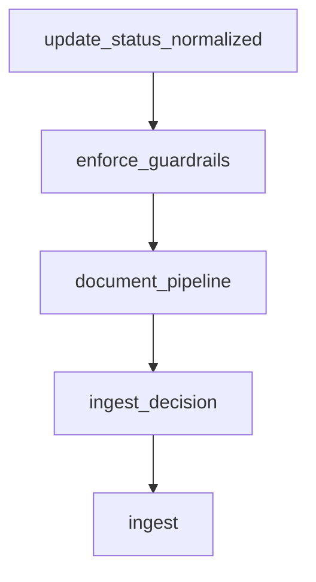

# Crawler – Überblick

Der Crawler übernimmt die kontinuierliche Synchronisation externer Quellen und
liefert normalisierte Dokumente an die RAG-Ingestion. Dieses Dokument fasst
Pipeline, Kernverträge und Betriebsschalter zusammen und orientiert sich am
Aufbau der übrigen App-Dokumentationen.

## Zweck
- Erstellt deterministische Frontier-Entscheidungen auf Basis von Robots-,
  Politeness- und Failure-Signalen, damit Quellen nur dann besucht werden, wenn
  es Policies erlauben und Recrawl-Intervalle eingehalten werden.【F:crawler/frontier.py†L14-L218】
- Führt Fetches ausschließlich im Worker aus, kapselt Limits und Telemetrie in
  `FetchResult` und übergibt Rohbytes samt Headern direkt an den AI-Core-Task
  `run_ingestion_graph`. Persistenz, Parsing und Lifecycle bleiben komplett im
  AI-Core.【F:crawler/worker.py†L1-L174】
- Der LangGraph orchestriert Guardrails, Normalisierung, Lifecycle und Delta
  über die Documents- und Guardrails-APIs. Follow-up-Aktionen (z. B. Embedding)
  werden nachgelagert ausgelöst und protokolliert.【F:ai_core/graphs/crawler_ingestion_graph.py†L1-L210】【F:ai_core/tasks.py†L1576-L1597】
- Telemetrie und Policy-Events laufen Ende-zu-Ende über Langfuse; der Worker
  liefert dafür nur noch Fetch-Daten und IDs, während AI-Core die Dokument- und
  Delta-Metriken erzeugt.【F:crawler/worker.py†L105-L174】

## Pipeline

- **`update_status_normalized`** persistiert den `normalized`-Lifecycle-Status
  im gemeinsamen Dokument-Store, bevor weitere Schritte laufen, und legt das
  Ergebnis als Artefakt für spätere Auswertungen ab.【F:ai_core/graphs/crawler_ingestion_graph.py†L552-L576】
- **`enforce_guardrails`** zieht Limits, Frontier-Kontext und Telemetriedaten
  heran, um Guardrail-Entscheidungen zu treffen, Policy-Events zu sammeln und
  Ablehnungen sofort in Lifecycle und Events zu spiegeln.【F:ai_core/graphs/crawler_ingestion_graph.py†L672-L741】
- **`document_pipeline`** orchestriert Parsing, Chunking und Artefakt-Bildung
  im Dokument-Graph, aktualisiert den Normalized-Payload und synchronisiert den
  `NormalizedDocument` im State für nachgelagerte Entscheidungen.【F:ai_core/graphs/crawler_ingestion_graph.py†L760-L864】
- **`ingest_decision`** kombiniert Delta-Vergleiche, Baseline-Reloads und neue
  Lifecycle-Einträge, um `new/changed/skip`-Entscheide sowie Folgeaktionen zu
  bestimmen.【F:ai_core/graphs/crawler_ingestion_graph.py†L866-L930】
- **`ingest`** triggert Embedding-Aufgaben nur für zulässige Deltas, reichert
  Observability-Spans an und übergibt optionale Upsert-Handler-Ergebnisse an
  das Artefakt-Set.【F:ai_core/graphs/crawler_ingestion_graph.py†L932-L1016】

## Kernverträge & Artefakte
| Modul | Verantwortung | Schlüsselklassen |
| --- | --- | --- |
| `crawler.frontier` | Robots-Compliance, Recrawl-Intervalle, Failure-Backoff | `FrontierDecision`, `RobotsPolicy`, `HostPolitenessPolicy` |
| `crawler.worker` | Fetch & Übergabe an AI-Core Task | `CrawlerWorker`, `WorkerPublishResult` |
| `ai_core.rag.guardrails` | Tenant/Host-Quoten, MIME- und Host-Blocklisten | `GuardrailLimits`, `GuardrailSignals`, `QuotaLimits` |
| `crawler.fetcher` | Kanonischer Fetch-Contract inkl. Limits und Telemetrie | `FetchRequest`, `FetchResult`, `FetcherLimits` |
| `crawler.http_fetcher` | Streaming-HTTP-Client mit Retries und User-Agent-Steuerung | `HttpFetcher`, `HttpFetcherConfig`, `FetchRetryPolicy` |
| `documents.api` | Normalisierte Dokumente und Provider-Referenzen | `NormalizedDocumentPayload`, `normalize_from_raw` |
| `documents.processing_graph` | LangGraph-Orchestrierung von Parsing, Chunking und Artefakt-Phasen | `DocumentProcessingPhase`, `DocumentProcessingState`, `build_document_processing_graph` |
| `documents.pipeline` | Pipeline-Konfiguration, Kontext und Statusübergänge | `DocumentPipelineConfig`, `DocumentProcessingMetadata`, `DocumentProcessingContext` |
| `ai_core.rag.delta` | Hashing & Near-Duplicate-Detektion | `DeltaDecision`, `DeltaSignatures`, `NearDuplicateSignature` |
| `ai_core.api` | Guardrail-Auswertung, Delta-Entscheidungen & API-Brücke zum Graph | `enforce_guardrails`, `decide_delta`, `trigger_embedding` |
| `ai_core.graphs.crawler_ingestion_graph` | Übergabe an RAG-Ingestion & Lifecycle | `CrawlerIngestionGraph`, `GraphTransition` |
| `crawler.errors` | Vereinheitlichtes Fehler-Vokabular | `CrawlerError`, `ErrorClass` |

## Normalisierung & Delta
- Der Worker legt Rohbytes im Object-Store ab und reicht nur noch den Pfad als
  `payload_path` durch. Die Normalisierung lädt diese Bytes transparent oder
  akzeptiert weiterhin Inline-Payloads (`payload_bytes`, `payload_base64`),
  dekodiert sie anhand optionaler Encoding-Hinweise und stellt sicher, dass
  Text, Checksums und Metadaten deterministisch aufgebaut werden – auch ohne
  vorgelagerten Parserlauf im Crawler.【F:crawler/worker.py†L1-L192】【F:documents/api.py†L94-L211】【F:documents/tests/test_api.py†L1-L67】
- `CrawlerIngestionGraph` erwartet bereits zum Start ein
  `NormalizedDocument` unter `state["normalized_document_input"]`; fehlt dieser,
  wird der Graph mit einem Fehler beendet. Upstream-Komponenten wie
  `documents.api.normalize_from_raw` liefern dafür den vollständigen
  `NormalizedDocumentPayload`, dessen `document`-Teil vor dem Graph-Aufruf in den
  State geschrieben wird (z. B. in `ai_core.views.ingest_document`).【F:ai_core/graphs/crawler_ingestion_graph.py†L424-L500】【F:documents/api.py†L286-L386】【F:ai_core/views.py†L1887-L1970】
- Parser- und Normalizer-Statistiken landen wie bisher in
  `NormalizedDocumentPayload.document.meta.parse_stats`. Die Normalisierung
  ergänzt Kennzahlen wie `normalizer.bytes_in`, womit Langfuse und Dead-Letter
  dieselbe Datengrundlage teilen.【F:documents/normalization.py†L120-L214】
- Delta-Bewertungen nutzen `ai_core.rag.delta.evaluate_delta` und speichern Content-Hashes sowie
  Near-Duplicate-Signaturen für spätere Vergleiche. Die tatsächliche
  Skip/Replace-Logik liegt im gemeinsamen Dedup-Service (`match_near_duplicate`)
  des Vector-Clients.【F:ai_core/rag/delta.py†L59-L111】【F:ai_core/rag/vector_client.py†L60-L220】

## Ingestion, Retire & Lifecycle
- Der LangGraph `CrawlerIngestionGraph` kombiniert Normalisierung, Delta-Status
  und optionale Lifecycle-Regeln. Statt eigener Payload-Klassen liefert die
  Entscheidung heute ein generisches `Decision`-Objekt mit validiertem
  `ChunkMeta` und artefaktbezogenen Feldern. Retire-Entscheidungen referenzieren
  dieselben Metadaten, sodass Downstream-Systeme ohne Sonderpfad auf die Services
  in `ai_core.api` zugreifen können.【F:ai_core/graphs/crawler_ingestion_graph.py†L40-L210】【F:ai_core/api.py†L123-L247】
- Lifecycle-Updates erfolgen über `documents.api.update_lifecycle_status`, die Persistenz und
  Validierung der Statusübergänge übernimmt `documents.repository`. Dadurch
  entfällt eine lokale Timeline-Implementierung im Crawler, alle Pfade nutzen
  dieselbe Quelle für erlaubte Zustandswechsel.【F:documents/api.py†L226-L273】【F:documents/repository.py†L160-L238】
- Fehler oder Policy-Denies werden über `CrawlerError` in Events gespiegelt und
  nutzen die gemeinsame Error-Class-Taxonomie (`timeout`, `rate_limit`,
  `policy_deny`, …). Das stellt sicher, dass Langfuse und Dead-Letter-Queues
  dieselbe Semantik verwenden.【F:crawler/errors.py†L1-L41】

## Konfiguration & Betriebsschalter
- **User Agent**: `CRAWLER_HTTP_USER_AGENT` kann in Django-Settings oder via
  Environment überschrieben werden. Fallback ist `noesis-crawler/1.0`.【F:noesis2/settings/base.py†L202-L202】【F:crawler/http_fetcher.py†L13-L45】
- **Fetcher Limits**: `FetcherLimits` decken Bytes-Limits, Timeouts und
  MIME-Whitelists ab. Violations werden als Policy-Events zurückgegeben und
  führen zu `FetchStatus.POLICY_DENIED`.【F:crawler/fetcher.py†L69-L119】
- **Retry-Policy**: `FetchRetryPolicy` steuert Anzahl Versuche, Backoff und
  Fehlergründe (HTTP 429/5xx, Netzwerkfehler). Backoff und Jitter sind pro
  Versuch berechenbar und werden in Telemetrie gespiegelt.【F:crawler/http_fetcher.py†L47-L106】
- **Guardrails**: `GuardrailLimits` erlauben Quoten pro Tenant oder Host,
  blocken MIME-Typen/Hosts und begrenzen Prozessdauer sowie Dokumentgröße.
  Überschreitungen erzeugen deterministische Policy-Events.【F:ai_core/rag/guardrails.py†L12-L131】
- **Recrawl-Intervalle**: `RecrawlFrequency` und `RECRAWL_INTERVALS` definieren
  stündliche bis wöchentliche Frequenzen und berücksichtigen Observed-Change- und
  Manual-Override-Signale.【F:crawler/frontier.py†L55-L115】

## Telemetrie & Fehlerhandhabung
- Die LangGraph-Knoten `_run_update_status`, `_run_guardrails`,
  `_run_document_pipeline`, `_run_ingest_decision` und `_run_ingestion`
  erzeugen strukturierte Artefakte (`status_update`, `guardrail_decision`,
  `document_pipeline_*`, `delta_decision`, `embedding_result`) sowie
  Span-Metadaten, die im Task-Ergebnis und in Langfuse wieder auftauchen.【F:ai_core/graphs/crawler_ingestion_graph.py†L552-L1016】
- Guardrail-Ablehnungen erhöhen das Prometheus-Counter-Feld
  `guardrail_denial_reason_total` und werden als Events `crawler_guardrail_denied`
  ausgespielt; diese Metriken bilden die Grundlage für Guardrail-Dashboards.【F:ai_core/graphs/crawler_ingestion_graph.py†L704-L741】【F:documents/metrics.py†L167-L185】
- `run_ingestion_graph` bereinigt nach dem Graph-Lauf den hinterlegten
  `raw_payload_path`, sodass Runbooks bei Fehlern gezielt nach dem Artefaktpfad
  suchen können, bevor der Cleanup greift.【F:ai_core/tasks.py†L1712-L1774】
- Alle Stufen liefern `policy_events` und optionale `CrawlerError`-Payloads, die
  direkt in Langfuse-Traces und Dead-Letter-Events übernommen werden. Sie
  korrespondieren mit den Pflichtfeldern aus dem Observability-Leitfaden.【F:crawler/fetcher.py†L121-L152】【F:ai_core/api.py†L121-L195】
- `FetchTelemetry` speichert Latenz, Bytes und Retry-Gründe. Die Werte fließen in
  Metrics (`crawler_fetch_latency_ms`, `crawler_fetch_bytes_total`) ein und
  werden von Guardrails genutzt, um Backoff-Strategien zu begründen.【F:crawler/fetcher.py†L81-L119】【F:docs/observability/crawler-langfuse.md†L9-L41】
- Lifecycle-Events werden beim Schreiben über das Repository mit Zeitstempeln
  versehen. Diese Daten fließen unverändert in Observability und SLA-Auswertung
  ein.【F:documents/repository.py†L160-L238】

## Erweiterungshinweise
- Neue Provider sollten Provider-Tags über `ProviderReference` normalisieren und
  sie im Dokument-Pipeline-Kontext weiterreichen; `DocumentProcessingMetadata`
  und `DocumentProcessingState` übernehmen die Referenzen unverändert in
  nachgelagerte Schritte.【F:documents/providers.py†L18-L132】【F:documents/pipeline.py†L229-L399】【F:documents/processing_graph.py†L147-L203】
- Weitere Guardrails lassen sich über `GuardrailLimits` erweitern; bei neuen
  Violations immer einen passenden `CrawlerError` mit eindeutiger
  `ErrorClass`-Zuordnung ausgeben.【F:ai_core/rag/guardrails.py†L41-L131】【F:crawler/errors.py†L1-L41】
- Für spezialisierte Recrawl-Logik kann `CrawlSignals.override_recrawl_frequency`
  befüllt werden, ohne die Standardintervalle hart zu ändern.【F:crawler/frontier.py†L67-L114】
