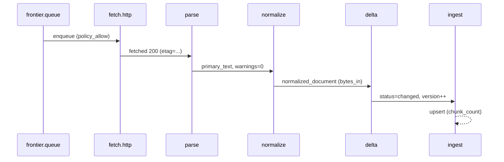

# Crawler Observability in Langfuse

Dieser Leitfaden definiert Trace-, Span- und Metrik-Konventionen für den Crawler-Lebenszyklus.
Er beschreibt ausschließlich semantische Verträge (keine Implementierungsdetails) und
stellt sicher, dass jede Quelle über Langfuse von der Frontier bis zur Ingestion
verfolgbar bleibt.

## Trace-Struktur
- **Root-Trace**: Pro Quelle ein Trace mit `trace.name=crawler.run`.
- **Span-Kette** (Reihenfolge):
  1. `frontier.queue`
  2. `fetch.http`
  3. `parse`
  4. `normalize`
  5. `delta`
  6. `ingest`
- **Pflichtattribute** auf *allen* Spans:
  - `noesis.external_id` – deterministische Identität der Quelle.
  - `noesis.tenant_id`, `noesis.workflow_id`, `noesis.document_id` (falls bereits zugeordnet).
  - `crawler.provider` – z. B. `web`, `confluence`, `github`.
  - `crawler.source_kind` – `http`, `pdf`, `api`.
  - `crawler.trace_id` – redundante Kopie des Trace-Schlüssels für Downstream-Events.

### Globale Pflichtattribute (Must Carry)
| Attribut | Beschreibung |
| --- | --- |
| `noesis.external_id` | Primärer Schlüssel für Quelle & Trace-Korrelation. |
| `crawler.provider` | Provider-Klassifizierung für Routing & Dashboards. |
| `crawler.trace_id` | Explizite Trace-ID-Spiegelung für Events & Logs. |

## Span-Attribute pro Phase

### `frontier.queue`
| Attribut | Beschreibung |
| --- | --- |
| `crawler.host` | Normalisierter Hostname (IDNA). |
| `crawler.path` | Kanonischer Pfad ohne Query. |
| `crawler.policy_decision` | Ergebnis (`enqueue`, `defer`, `skip`, `retire`). |
| `crawler.next_visit_at` | ISO-Zeitpunkt der frühesten Ausführung. |
| `crawler.retry_count` | Aktueller Retry-Level inkl. Backoff. |
| `crawler.crawl_delay_ms` | Effektive Politeness-Latenz. |
| `crawler.manual_override` | Boolean/Enum, ob Override-Regeln greifen. |
| `noesis.reason` | Kurzcode (z. B. `robots_allow`, `rate_limit`). |

### `fetch.http`
| Attribut | Beschreibung |
| --- | --- |
| `http.status_code` | HTTP Status (auch für 304/4xx/5xx). |
| `http.host` | Zielhost (für Service-Zuordnung). |
| `http.method` | Normalerweise `GET` (ggf. `HEAD`). |
| `http.user_agent` | Effektiver UA-String. |
| `http.retry` | Fetch-Retry-Zähler. |
| `http.latency_ms` | Dauer der Remote-Antwort. |
| `http.response_size` | Bytes der Response (Header+Body). |
| `http.content_type` | Finaler MIME-Typ (inkl. Charset). |
| `http.etag` | Übernommener ETag oder `null`. |
| `http.last_modified` | Zeitstempel aus Header oder `null`. |
| `crawler.policy_enforced` | Enum (`ok`, `denied`, `timeout`, `size_limit`). |

### `parse`
| Attribut | Beschreibung |
| --- | --- |
| `parser.media_type` | Klassifizierter Medientyp (`text/html`, `application/pdf`, `application/json`). |
| `parser.bytes_in` | Größe der Eingabe. |
| `parser.primary_text_length` | Anzahl Zeichen des extrahierten Haupttextes. |
| `parser.token_count` | Token-Schätzung nach Konvention. |
| `parser.language` | BCP 47-Tag oder `null`. |
| `parser.warning_count` | Anzahl generierter Warnungen. |
| `parser.strategy` | Verwendeter Parser-Modus (`html.boilerplate`, `pdf.extraction`, `json.schema`). |

### `normalize`
| Attribut | Beschreibung |
| --- | --- |
| `normalizer.origin_uri` | Kanonische Quelle (entspricht Frontier). |
| `normalizer.title` | Normalisierter Titel (oder leer). |
| `normalizer.language` | Übernommene Sprache aus Parser. |
| `normalizer.bytes_in` | Größe des normalisierten Dokuments (optional). |
| `normalizer.tag_count` | Anzahl gesetzter Tags. |
| `normalizer.parser_token_count` | Spiegelung der Parser-Stats für Konsistenz. |
| `normalizer.validation_status` | `ok`, `missing_workflow`, `invalid_meta`, … |
| `normalizer.warning_count` | Warnungen aus Parser/Normalizer. |

### `delta`
| Attribut | Beschreibung |
| --- | --- |
| `delta.status` | `new`, `changed`, `unchanged`, `near_duplicate`. |
| `delta.content_hash` | Hex-Präfix (8 Zeichen) für Hash-Vergleiche. |
| `delta.previous_hash` | Vorheriger Hash oder `null`. |
| `delta.version` | Resultierende Version nach Entscheidung. |
| `delta.near_duplicate_score` | Float 0–1 (Jaccard/Ähnlichkeit). |
| `delta.reference_document_id` | Bei Near-Dupe verwendete Referenz. |
| `delta.policy_action` | `upsert`, `skip`, `flag`. |
| `noesis.case_id` | Optional gespiegelt, wenn der Delta-Schritt bereits Case-Kontext besitzt. |

### `ingest`
| Attribut | Beschreibung |
| --- | --- |
| `ingest.decision` | `upsert`, `skip`, `retire`. |
| `ingest.chunk_count` | Anzahl erzeugter Chunks. |
| `ingest.payload_size` | Bytes der Nutzlast (JSON). |
| `ingest.embedding_profile` | Profil-ID für Embedding (falls vergeben). |
| `ingest.queue` | Ziel-Queue oder Worker-Gruppe. |
| `ingest.retries` | Anzahl Wiederholungen im Ingestion-Adapter. |
| `ingest.error_code` | Bei Fehlern; Codes folgen dem [RAG-Fehler-Vokabular](../rag/ingestion.md#fehlertoleranz-und-deduplizierung). |
| `noesis.case_id` | Pflichtfeld für die Korrelation zu RAG-Artefakten. |

## Events (Span-gebunden)
| Event | Zugehöriger Span | Attribute |
| --- | --- | --- |
| `policy_deny` | `frontier.queue` oder `fetch.http` | `reason`, `robots_path`, `crawl_delay_ms`. |
| `not_modified` | `fetch.http` | `etag`, `last_modified`. |
| `gone` | `fetch.http` | `status_code`, `reason`. |
| `temporary_error` | `fetch.http` | `status_code`, `retry_in_ms`. |
| `changed` | `delta` | `content_hash`, `version`. |
| `unchanged` | `delta` | `content_hash`. |
| `near_duplicate` | `delta` | `score`, `reference_document_id`. |
| `ingestion_failure` | `ingest` | `error_code`, `http_status` (falls API-Call). |

Jedes Event übernimmt `noesis.external_id`, `noesis.tenant_id`, `crawler.provider` aus dem Span-Kontext.

## Fehlerklassen

Alle Fehler werden auf das gemeinsame Vokabular aus `crawler.errors.ErrorClass` gemappt. Die Klassen dienen als Span-Attribut
(`crawler.error_class`) und als Payload für Events. Typische Zuordnungen:

| Fehlerklasse | Entstehung | Beispielattribute |
| --- | --- | --- |
| `timeout` | HTTP-Fetcher (`read_timeout`, `connect_timeout`) | `retry_reason`, `http.status_code` (optional) |
| `rate_limit` | Lokale Politeness-/Policy-Limits (z. B. Frontier Backoff) | `policy_events=rate_limited` |
| `transient_network` | Temporäre Netzwerk-/Proxy-Fehler, 5xx, Redirect-Schleifen | `detail`, `retry_reason` |
| `not_found` | HTTP 404 | `http.status_code=404` |
| `gone` | HTTP 410, TLS-Permanentschäden, Zertifikatsfehler | `detail=tls_error` |
| `unsupported_media` | Parser-Vertrag: Medientyp nicht unterstützt | `parser.media_type`, `diagnostics` |
| `parser_failure` | Parser-Laufzeitfehler | `diagnostics`, `parser.strategy` |
| `policy_deny` | Fetcher-Sicherheitsgrenzen, HTTP 401/403/451 | `policy_events`, `detail` |
| `upstream_429` | HTTP 429 nach Retries | `http.status_code=429`, `retry_reason=status_429` |
| `ingestion_failure` | RAG-Ingestion (Adapter-/Upsert-Fehler) | `ingest.error_code`, `http.status_code` |

Der Helper `crawler.ingestion.build_ingestion_error(...)` erstellt konsistente Fehlerobjekte für Ingestion-Failures und ergänzt
automatisch `error_code`/`status_code`. Fetcher- und Parser-Ergebnisse liefern ihre Fehler über die jeweiligen Contract-Klassen.

## Metriken pro Phase
| Span | Metrik | Typ | Labels | Beschreibung |
| --- | --- | --- | --- | --- |
| `frontier.queue` | `crawler_frontier_decision_total` | Counter | `decision`, `provider` | Anzahl Queue-Entscheidungen je Provider. |
| `frontier.queue` | `crawler_frontier_delay_ms` | Histogram | `provider` | Verteilte Politeness-Delays. |
| `fetch.http` | `crawler_fetch_latency_ms` | Histogram | `provider`, `status_code` | Remote-Latenzen nach Statusklasse. |
| `fetch.http` | `crawler_fetch_bytes_total` | Counter | `provider`, `status_code` | Transferierte Bytes. |
| `parse` | `crawler_parse_duration_ms` | Histogram | `media_type`, `provider` | Parser-Laufzeiten. |
| `parse` | `crawler_parse_text_tokens` | Histogram | `media_type` | Tokenanzahl-Verteilung. |
| `normalize` | `crawler_normalize_duration_ms` | Histogram | `provider` | Normalizer-Laufzeiten. |
| `delta` | `crawler_delta_decision_total` | Counter | `status`, `provider` | Delta-Ergebnisse. |
| `delta` | `crawler_delta_near_dupe_score` | Histogram | `provider` | Score-Verteilung (Sampling). |
| `ingest` | `crawler_ingest_decision_total` | Counter | `decision`, `provider` | Upsert/Skip/Retire-Zählung. |
| `ingest` | `crawler_ingest_chunk_count` | Histogram | `provider` | Chunk-Anzahlen pro Dokument. |

Die Metriken werden an den jeweiligen Span angehängt (OTel View) und übernehmen automatisch `noesis.external_id` als Resource-Attribut.

## Timeline & Entscheidungsgründe
- Ein vollständiger Trace enthält alle oben genannten Spans und Events.
- Entscheidungsgründe sind über `crawler.policy_decision`, `delta.status`, `ingest.decision`
  sowie die Events `policy_deny`, `unchanged`, `ingestion_failure` nachvollziehbar.
- Für Audits wird empfohlen, im Langfuse-Dashboard pro Trace die Attribute
  `noesis.reason`, `delta.policy_action`, `ingest.error_code` zu visualisieren.

## Korrelation & Weitergabe
- `trace_id` aus der Frontier bleibt unverändert und wird über Worker/Tasks hinweg propagiert.
- `noesis.external_id` ist Pflichtattribut jeder Telemetrie und erlaubt Zusammenführung mit Persistenz-Daten.
- Downstream-Systeme (z. B. Alerts) können anhand von `crawler.provider`
  und `crawler.host` priorisiert werden.

### Beispiel-Timeline

## Sampling & Aufbewahrung
- Standard-Sampling: Frontier & Fetch 100 % (relevant für Policy-Fehler), nachfolgende Phasen min. 25 %.
- Alle Events (`policy_deny`, `ingestion_failure`, `gone`) sind **unsampled** und werden immer gesendet.
- Aufbewahrung orientiert sich an Langfuse-Default (30 Tage); kritische Fälle werden zusätzlich exportiert
  (`ingestion_failure`, `near_duplicate` mit Score > 0.9).
