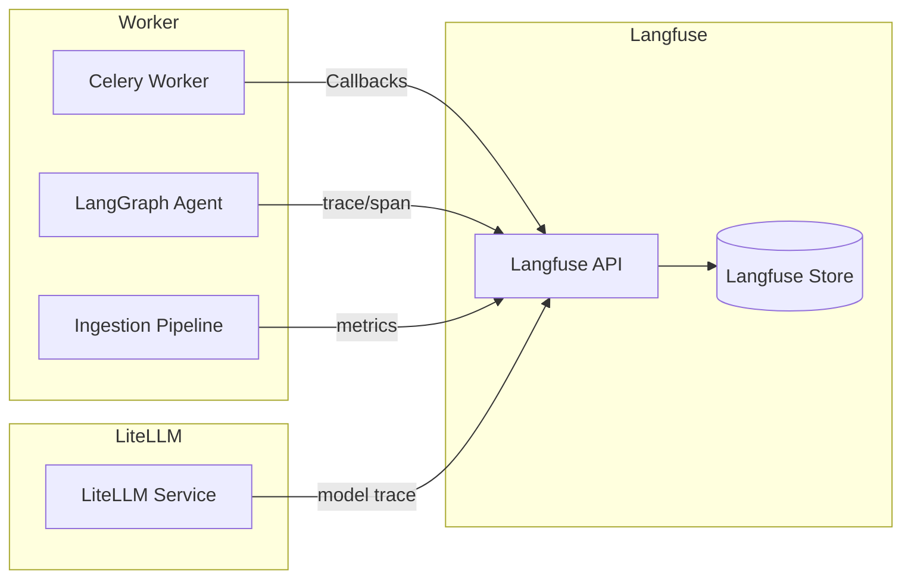

# Warum
Langfuse bündelt Tracing und Kostenkontrolle für Agenten, Ingestion und LiteLLM. Dieses Kapitel zeigt Integration, Datenflüsse und Alarmierung.

# Wie
## Datenfluss

- Worker binden das Langfuse Python SDK (`langfuse.decorators`, Async-Callbacks) ein. Jeder Task sendet `trace_id`, `tenant_id`, `operation`.
- LangGraph nutzt das integrierte Observability-Plugin; Nodes melden `span`-Informationen inklusive Input/Output-Metadaten.
- Ingestion sendet Batch-Statistiken (`batch_size`, `duration`, `cost_estimate`) über Custom Metrics.
- LiteLLM aktiviert Model-Trace per ENV `LANGFUSE_HOST`, `LANGFUSE_PUBLIC_KEY`, `LANGFUSE_SECRET_KEY`, `LANGFUSE_KEY`; Sampling wird über `LANGFUSE_SAMPLE_RATE` (0.05 Prod, 0.25 Staging) gesteuert.

## Felder und Sampling
| Feld | Quelle | Beschreibung |
| --- | --- | --- |
| `trace_id` | Django Request ID | Verbindet Web, Celery, LangGraph |
| `tenant_id` | Celery Task Meta | Steuert RLS und Filter |
| `operation` | Task- oder Node-Name | `ingestion.embed`, `agent.reason`, `liteLLM.call` |
| `cost_total` | LiteLLM | Aggregierte Kosten pro Request |
| `error_type` | Worker/LiteLLM | Klassifiziert Fehlertyp (z.B. `rate_limit`) |
| `visibility_effective` | VectorStoreRouter | Wirksame Soft-Delete-Sichtbarkeit (`active`, `all`, `deleted`) pro Retrieval-Span |
| `deleted_matches_blocked` | VectorStoreRouter | Anzahl der durch `visibility=active` weggefilterten Kandidaten |

- Sampling-Richtwerte: Prod 5%, Staging 25%, Dev 100%. Anpassungen erfolgen über `LANGFUSE_SAMPLE_RATE` und werden im [Security-Guide](../security/secrets.md) dokumentiert.
- Retrieval-Spans laufen als `rag.hybrid.search` ein und tragen `visibility_effective` sowie `deleted_matches_blocked`, damit Guard-Entscheidungen zu Soft-Deletes sichtbar werden.
- Hard-Delete-Läufe erzeugen einen Span `rag.hard_delete` mit Zählern (`documents_deleted`, `not_found`, `vacuum`, `reindex`, `operator`, `actor_mode`), sodass Audit und Bereinigungsschritte nachvollziehbar bleiben.
- PII-Redaction: Die Anwendung maskiert PII vor jedem LLM-Aufruf; Langfuse erhält bereits redaktierte Daten. Zusätzliche Langfuse-Regeln sind optional.
- Dashboards: Standard-Dashboards `Agent Erfolg`, `Ingestion Durchsatz`, `Kosten pro Tenant`. Alerts lösen bei Fehlerquote >5% oder Kosten >80% Budget aus.

# Schritte
1. Installiere und initialisiere das Langfuse SDK in Worker und Agenten (siehe [Docker-Konventionen](../docker/conventions.md)); setze ENV `LANGFUSE_*` laut [Security](../security/secrets.md).
2. Aktiviere LiteLLM Model-Trace (`LANGFUSE_*`, `LANGFUSE_SAMPLE_RATE`) und validiere Traces über die GUI.
3. Richte Dashboards und Alerts ein, dokumentiere Schwellenwerte im Incident-Runbook und überprüfe sie nach jedem Release.
