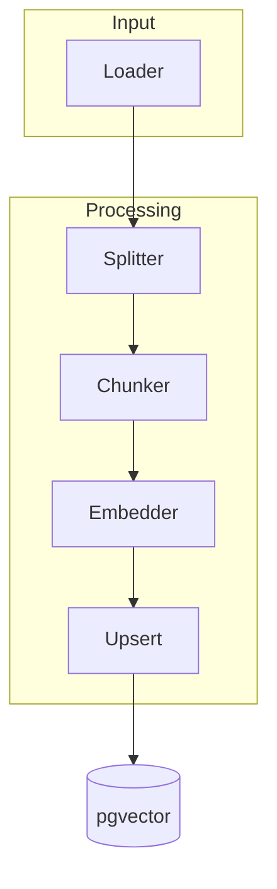

# Warum
Die Ingestion-Pipeline speist Inhalte in den RAG-Store ein. Dieses Dokument beschreibt den Ablauf, Parametergrenzen und Fehlertoleranz, damit Junior-Entwickler verlässlich Embeddings erzeugen. Es gibt keinen Legacy-Import; wir starten bewusst from scratch.

# Wie
## Pipeline

- Loader nutzen eine generische Schnittstelle und liefern strukturierte Records; Anbindungen an externe Quellen folgen als Erweiterung.
- Splitter normalisiert Formate (Markdown → Plaintext), Chunker erzeugt überlappende Stücke.
- Embedder ruft LiteLLM mit `EMBEDDINGS_MODEL`/`EMBEDDINGS_API_BASE` auf und schreibt Ergebnisse in `pgvector`.
- Upsert nutzt Hashes, um Duplikate zu überspringen und `documents.deleted_at` zu respektieren.

## Parameter
| Parameter | Default | Grenze | Beschreibung |
| --- | --- | --- | --- |
| `CHUNK_SIZE` | 800 Tokens | 1.200 | Größe eines Textchunks; größer erhöht Kontext, aber auch Embedding-Kosten |
| `CHUNK_OVERLAP` | 80 Tokens | 200 | Überlappung zwischen Chunks; reduziert Informationsverlust |
| `BATCH_SIZE` | 128 Chunks | 256 | Anzahl Embeddings pro API-Aufruf; beeinflusst Latenz und Rate-Limit |
| `MAX_TOKENS` | 3.000 | 4.096 | Sicherheitslimit für Model-Requests |
| `RETRY_BACKOFF` | 30s → x2 | 5m Max | Exponentielles Backoff bei Fehlern |

## API-Contract

- `ai_core.ingestion.run_ingestion` verlangt einen expliziten `embedding_profile`-Parameter. `ai_core.rag.resolve_ingestion_profile()` validiert den Profilschlüssel zur Laufzeit und liefert den dazugehörigen Vector Space.
- Erfolgreiche Läufe übernehmen `embedding_profile` und `vector_space_id` in Statusdateien, Chunk-Metadaten und Dead-Letter-Payloads. Traces/Logs enthalten dieselben Felder, damit SRE das Profil/den Space jeder Operation nachvollziehen kann.
- Dead-Letter-Einträge führen zusätzlich `vector_space_schema`, `vector_space_backend` sowie `vector_space_dimension`, sodass Incidents ohne manuelles Nachschlagen der Konfiguration analysiert werden können.
- `ai_core.rag.ensure_embedding_dimensions()` stoppt das Upsert, sobald `len(embedding)` nicht mit der Vector-Space-Dimension übereinstimmt, und markiert den Lauf mit `INGEST_VECTOR_DIMENSION_MISMATCH` inklusive `tenant_id`, `process`, `doc_class` und Profil im Dead Letter.

## Fehlertoleranz und Deduplizierung
- Jeder Datensatz erhält einen SHA-256-Hash aus `(tenant_id, source, content)`. Der Hash wird vor Upsert geprüft; Matches werden übersprungen, auch wenn der Startbestand leer ist.
- Bei Rate-Limits markiert der Worker den Batch als „retry“ und wartet laut Backoff. Nach fünf Fehlversuchen landet der Eintrag in einer Dead-Letter-Queue zur manuellen Prüfung.
- Netzwerkfehler lösen Wiederholungen aus; nach Erfolg werden Dead-Letter-Einträge automatisch erneut angestoßen.
- Fehler werden in Langfuse als Span `ingestion.error` mit Metadaten protokolliert.

# Schritte
1. Konfiguriere Loader, Splitter und Embedding-Parameter laut Tabelle und verknüpfe sie mit der Queue `ingestion` (siehe [Docker-Konventionen](../docker/conventions.md)).
2. Starte Testbatches in Staging über die Pipeline-Stufe „Ingestion-Smoke“ und beobachte Langfuse- sowie Cloud-SQL-Statistiken.
3. Übernimm dieselben Einstellungen nach Prod, dokumentiere Anpassungen (z.B. `BATCH_SIZE`) und aktiviere Alerts im [Langfuse Guide](../observability/langfuse.md).
