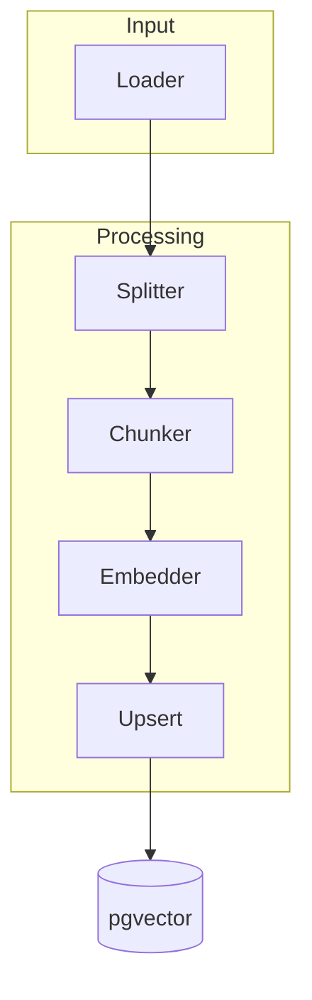

# Warum
Die Ingestion-Pipeline speist Inhalte in den RAG-Store ein. Dieses Dokument beschreibt den Ablauf, Parametergrenzen und Fehlertoleranz, damit Junior-Entwickler verlässlich Embeddings erzeugen. Es gibt keinen Legacy-Import; wir starten bewusst from scratch.

# Wie
## Pipeline

- Loader nutzen eine generische Schnittstelle und liefern strukturierte Records; Anbindungen an externe Quellen folgen als Erweiterung.
- Splitter normalisiert Formate (Markdown → Plaintext), Chunker erzeugt überlappende Stücke.
- Embedder ruft LiteLLM über `ai_core.rag.embeddings.EmbeddingClient` auf, nutzt `EMBEDDINGS_MODEL_PRIMARY` (optional `EMBEDDINGS_MODEL_FALLBACK`) sowie `EMBEDDINGS_PROVIDER` und schreibt Ergebnisse in `pgvector`.
- Upsert nutzt Hashes, um Duplikate zu überspringen und `documents.deleted_at` zu respektieren.

## Upload → Ingest-Trigger
- **Upload-Phase (`POST /ai/rag/documents/upload/`)**: Der Web-Service nimmt Dateien inklusive Tenant- und Projektkontext an, legt die Metadaten in `documents` ab und gibt eine `document_id` zurück. Dateien landen im Objektspeicher; ihre Verarbeitung endet hier bewusst, damit Upload-Latenzen nicht von der Embedding-Pipeline abhängen.
- **Trigger-Phase (`POST /ai/rag/ingestion/run/`)**: Ein zweiter Request stößt den eigentlichen Ingest via Celery an (`ingestion` Queue). Der Request erwartet einen JSON-Body mit `document_ids` (Array), sodass mehrere Dokumente gebündelt angestoßen werden können. Der Worker liest die zuvor gesicherten Assets, führt Split/Chunk/Embed aus und schreibt Ergebnisse in `pgvector`.
- **Skalierung & Zuverlässigkeit**: Die entkoppelte Abfolge erlaubt horizontales Skalieren der Upload- und Ingestion-Services unabhängig voneinander, isoliert Backpressure in der Queue und ermöglicht Retries ohne erneuten Datei-Upload. Asynchrone Verarbeitung verhindert Timeouts großer Dateien, während Dead-Letter-Mechanismen und konfigurierbares Backoff gezielt Fehlerfälle abfedern.

## Parameter
| Setting | Default | Grenze | Beschreibung |
| --- | --- | --- | --- |
| `RAG_CHUNK_TARGET_TOKENS` | 450 Tokens | Hard-Limit 512 Tokens (per Code) | Zielgröße eines Textchunks; größere Werte erhöhen Kontext, kleinere reduzieren Kosten |
| `RAG_CHUNK_OVERLAP_TOKENS` | 80 Tokens | Konfigurierbar, keine harte Obergrenze | Überlappung zwischen Chunks; reduziert Informationsverlust |
| `EMBEDDINGS_BATCH_SIZE` | 64 Chunks | Worker erzwingt nur `>= 1` | Anzahl Embeddings pro LiteLLM-Call; beeinflusst Latenz und Rate-Limit |
| `RAG_RETRY_BASE_DELAY_MS` | 50 ms | Linear (Versuch * Delay) | Linearer Backoff der pgvector-Operationen; begrenzt von `RAG_RETRY_ATTEMPTS` |

## API-Contract

- `ai_core.ingestion.run_ingestion` verlangt einen expliziten `embedding_profile`-Parameter. `ai_core.rag.resolve_ingestion_profile()` validiert den Profilschlüssel zur Laufzeit und liefert den dazugehörigen Vector Space.
- Erfolgreiche Läufe übernehmen `embedding_profile` und `vector_space_id` in Statusdateien, Chunk-Metadaten und Dead-Letter-Payloads. Traces/Logs enthalten dieselben Felder, damit SRE das Profil/den Space jeder Operation nachvollziehen kann.
- Dead-Letter-Einträge führen zusätzlich `vector_space_schema`, `vector_space_backend` sowie `vector_space_dimension`, sodass Incidents ohne manuelles Nachschlagen der Konfiguration analysiert werden können.
- `ai_core.rag.ensure_embedding_dimensions()` stoppt das Upsert, sobald `len(embedding)` nicht mit der Vector-Space-Dimension übereinstimmt, und markiert den Lauf mit `INGEST_VECTOR_DIMENSION_MISMATCH` inklusive `tenant_id`, `process`, `doc_class` und Profil im Dead Letter.

## Fehlertoleranz und Deduplizierung
- Jeder Datensatz erhält einen SHA-256-Hash aus `(tenant_id, source, content)`. Der Hash wird vor Upsert geprüft; Matches werden übersprungen, auch wenn der Startbestand leer ist.
- Bei Rate-Limits markiert der Worker den Batch als „retry“ und wartet laut Backoff. Nach fünf Fehlversuchen landet der Eintrag in einer Dead-Letter-Queue zur manuellen Prüfung.
- Netzwerkfehler lösen Wiederholungen aus; nach Erfolg werden Dead-Letter-Einträge automatisch erneut angestoßen.
- Fehler werden in Langfuse als Span `ingestion.error` mit Metadaten protokolliert.

# Schritte
1. Lade das Dokument via `POST /ai/rag/documents/upload/` hoch, dokumentiere die zurückgegebene `document_id` und prüfe Upload-Fehler (z.B. Tenant-Mismatch, Dateigrößenlimit) sofort im Response.
2. Stoße den Ingest mit `POST /ai/rag/ingestion/run/` samt Payload `{ "document_ids": [<document_id>] }` an; ein 202-Response signalisiert, dass der Task in der `ingestion` Queue liegt. Bei 4xx-Replies Profil-/Statusfehler korrigieren, bei 5xx erneut triggern oder einen Retry-Job anlegen.
3. Überwache den Worker-Lauf (Langfuse Trace `ingestion.*`, Dead-Letter-Queue, Cloud-SQL-Metriken) und führe bei Backpressure-Peaks ein gestaffeltes Retriggering durch, bevor du in Prod ausrollst. Einstellungen wie `BATCH_SIZE` dokumentieren und Alerts im [Langfuse Guide](../observability/langfuse.md) aktivieren.
