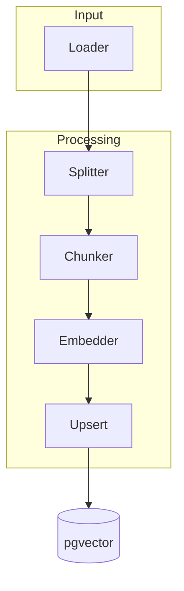
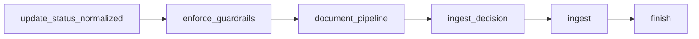

# Warum

Der Ingestion-Graph speist Inhalte in den RAG-Store ein. Dieses Dokument beschreibt den Ablauf, Parametergrenzen und Fehlertoleranz, damit Junior-Entwickler verlässlich Embeddings erzeugen. Es gibt keinen Legacy-Import; wir starten bewusst from scratch.

*Hinweis: Der Begriff „Pipeline“ ist eine historische Bezeichnung für den heute als „Graph“ (LangGraph) bezeichneten Orchestrierungs-Flow.*

# Wie

## Ingestion-Graph

- Loader nutzen eine generische Schnittstelle und liefern strukturierte Records; Anbindungen an externe Quellen folgen als Erweiterung.
- Splitter normalisiert Formate (Markdown → Plaintext), Chunker erzeugt überlappende Stücke.
- Embedder ruft LiteLLM über `ai_core.rag.embeddings.EmbeddingClient` auf, nutzt `EMBEDDINGS_MODEL_PRIMARY` (optional `EMBEDDINGS_MODEL_FALLBACK`) sowie `EMBEDDINGS_PROVIDER` und schreibt Ergebnisse in `pgvector`.
- Upsert nutzt Hashes, um Duplikate zu überspringen und den Lifecycle (`documents.lifecycle` sowie `chunks.metadata->>'lifecycle_state'`) zu respektieren.
- Der Crawler-Ingestion-Graph speichert normalisierte Dokumente zuerst über
  `documents.repository.DocumentsRepository.upsert()` und übergibt anschließend
  strukturierte Chunks an den Standard-Vector-Client
  (`ai_core.rag.vector_client.get_default_client().upsert_chunks`). Auf diese
  Weise bleiben Dokumentenspeicher und Vector-Space synchron, bevor optionale
  Retire-Entscheidungen `update_lifecycle_state` für betroffene Dokumente
  triggern.

## Crawler → RAG End-to-End

- Der `CrawlerIngestionGraph` verhält sich nun als Wrapper um den `DocumentProcessingGraph`.
- Die Spans folgen dem Muster `crawler.ingestion.run` (Parent) → `document.processing.*` (Children: `parse`, `persist`, `embed` etc.).
- Die ursprünglichen Node-Namen (`ingest_decision`, `enforce_guardrails`) wurden durch die standardisierten Nodes des `DocumentProcessingGraph` ersetzt, wobei die Entscheidungslogik (Delta, Guardrails) erhalten bleibt.
- Tests validieren die korrekte Integration und Metadaten-Übergabe.

## Upload → Ingest-Trigger

- **Upload-Phase (`POST /ai/rag/documents/upload/`)**: Der Web-Service nimmt Dateien inklusive Tenant- und Projektkontext an, legt die Metadaten in `documents` ab und gibt eine `document_id` zurück. Dateien landen im Objektspeicher; ihre Verarbeitung endet hier bewusst, damit Upload-Latenzen nicht vom Embedding-Graph abhängen. `handle_document_upload` queued dabei sofort den zugehörigen `run_ingestion_graph` Task, sodass keine manuelle Bestätigung notwendig ist.
- **Trigger-Phase (`POST /ai/rag/ingestion/run/`)**: Ein zweiter Request stößt den eigentlichen Ingest via Celery an (`ingestion` Queue). Der Request erwartet einen JSON-Body mit `document_ids` (Array), sodass mehrere Dokumente gebündelt angestoßen werden können. Das Run-Endpoint wird primär für Replays oder geplante Batch-Runs benötigt, weil reguläre Uploads bereits automatisch in der Queue landen. Der Worker liest die zuvor gesicherten Assets, führt Split/Chunk/Embed aus und schreibt Ergebnisse in `pgvector`.
- **Skalierung & Zuverlässigkeit**: Die entkoppelte Abfolge erlaubt horizontales Skalieren der Upload- und Ingestion-Services unabhängig voneinander, isoliert Backpressure in der Queue und ermöglicht Retries ohne erneuten Datei-Upload. Asynchrone Verarbeitung verhindert Timeouts großer Dateien, während Dead-Letter-Mechanismen und konfigurierbares Backoff gezielt Fehlerfälle abfedern.
- **Bild-Uploads**: `ImageDocumentParser` akzeptiert Rasterformate (`image/jpeg`, `image/png`, `image/webp`, `image/gif`, `image/tiff`, `image/bmp`). Der Parser erzeugt einen Haupt-Asset mit den Bildbytes sowie einen Platzhalter-Textblock, damit Downstream-Chains keinen leeren Content erhalten. Die Parser-Statistiken enthalten mindestens `parser.kind=image`, `parser.bytes=<payload_size>` und `parser.assets=1`, sodass Langfuse/OTel die Laufzeitgrößen loggen kann.

## Parameter

| Setting | Default | Grenze | Beschreibung |
| --- | --- | --- | --- |
| `RAG_CHUNK_TARGET_TOKENS` | 450 Tokens | Hard-Limit 512 Tokens (per Code) | Zielgröße eines Textchunks; größere Werte erhöhen Kontext, kleinere reduzieren Kosten |
| `RAG_CHUNK_OVERLAP_TOKENS` | 80 Tokens | Konfigurierbar, keine harte Obergrenze | Überlappung zwischen Chunks; reduziert Informationsverlust |
| `EMBEDDINGS_BATCH_SIZE` | 64 Chunks | Worker erzwingt nur `>= 1` | Anzahl Embeddings pro LiteLLM-Call; beeinflusst Latenz und Rate-Limit |

## Fehlertoleranz und Deduplizierung

- Jeder Datensatz erhält einen SHA-256-Hash aus `(tenant_id, source, content)`. Der Hash wird vor Upsert geprüft; Matches werden übersprungen, auch wenn der Startbestand leer ist.
- Bei Rate-Limits markiert der Worker den Batch als „retry“ und wartet laut Backoff. Nach fünf Fehlversuchen landet der Eintrag in einer Dead-Letter-Queue zur manuellen Prüfung.
- Netzwerkfehler lösen Wiederholungen aus; nach Erfolg werden Dead-Letter-Einträge automatisch erneut angestoßen.
- Fehler werden in Langfuse als Span `ingestion.error` mit Metadaten protokolliert.

### Fehlercodes

- Die Ingestion-Adapter geben Fehler über `ingest.error_code` weiter. Die Werte folgen dem gemeinsamen Crawler-Vokabular (`crawler.errors.ErrorClass`) und verlinken damit die Telemetrie in Langfuse mit den RAG-Runbooks.

## Near-Duplicate Detection

- `RAG_NEAR_DUPLICATE_THRESHOLD` vergleicht eine kosinus-ähnliche Ähnlichkeit in
  `[0,1]`, unabhängig davon, ob der Index per Cosine- (`<=>`) oder L2-Operator
  (`<->`) gesucht wird. Werte wie `0.97` bedeuten somit immer „97 % ähnlich“.
- `RAG_NEAR_DUPLICATE_REQUIRE_UNIT_NORM` muss auf `true` stehen, damit der
  L2-Pfad aktiv bleibt; andernfalls wird auf Cosine zurückgefallen, da die
  L2-Skalierung nur mit unit-normalisierten Embeddings mathematisch korrekt
  ist.

# Schritte

1. Lade das Dokument via `POST /ai/rag/documents/upload/` hoch, dokumentiere die zurückgegebene `document_id` und prüfe Upload-Fehler (z.B. Tenant-Mismatch, Dateigrößenlimit) sofort im Response.
2. Prüfe, dass der Upload-Handler den `run_ingestion_graph`-Task erfolgreich in die `ingestion` Queue gelegt hat (Langfuse Trace `crawler.ingestion.ingest` oder Celery-Monitoring). Das Endpoint `POST /ai/rag/ingestion/run/` bleibt für Replays und geplante Batch-Runs verfügbar; dort stößt Payload `{ "document_ids": [<document_id>] }` einen neuen Task an.
3. Überwache den Worker-Lauf (Langfuse Trace `ingestion.*`, Dead-Letter-Queue, Cloud-SQL-Metriken) und führe bei Backpressure-Peaks ein gestaffeltes Retriggering durch, bevor du in Prod ausrollst. Einstellungen wie `BATCH_SIZE` dokumentieren und Alerts im [Langfuse Guide](../observability/langfuse.md) aktivieren.
4. Für Crawler-Quellen zeigt LangGraph die `crawler.ingestion.*`-Spans exakt in der Reihenfolge `update_status_normalized → enforce_guardrails → document_pipeline → ingest_decision → ingest → finish`. Die Guardrails prüfen den Status vor dem Dokumentlauf, `document_pipeline` schreibt normalisierte Inhalte, `ingest_decision` entscheidet über Upserts versus Retire und `ingest` orchestriert Vector-Updates, bevor `finish` die Laufzeitmetriken abschließt.
