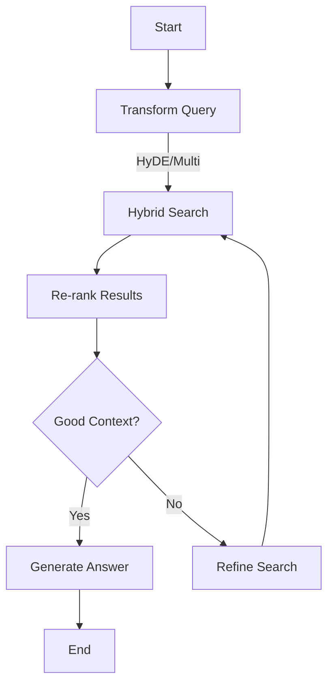

# RAG SOTA Roadmap & Implementation Plan

> [!NOTE]
> **Status**: Draft
> **Date**: 2026-01-09
> **Goal**: Evolve RAG Chat from "Stub" to "State of the Art" (AI First System)

## 1. Current Architecture Review (The "Stub")

The current implementation at `http://dev.localhost:8000/rag-tools/#chat` is a functional but stateless prototype.

### Findings

- **Stateless**: The `chat_submit` view (`theme/views_chat.py`) treats every request as independent. There is no conversation memory, thread management, or context carry-over.
- **Direct Graph Call**: It calls `retrieval_augmented_generation.run` directly. This graph (`ai_core/graphs/technical/retrieval_augmented_generation.py`) is a simple `Retrieve -> Compose` pipe with no loops or reasoning.
- **Hardcoded Parameters**: Hybrid search uses fixed parameters (`alpha=0.5`), and the prompt is implicit in the `Compose` node.
- **Boundary IO Bypassed**: The RAG graph has an IO spec (`RAG_GRAPH_IO`), but the view does not use `schema_id`/`schema_version` or the boundary model.
- **Hybrid Param Surface**: The retrieve node accepts `alpha`, `min_sim`, `top_k`, `vec_limit`, `lex_limit`, `trgm_limit`, `max_candidates`, `diversify_strength` (see `ai_core/nodes/_hybrid_params.py`), but the UI does not expose them.
- **Frontend Coupling**: Usage of inline HTML in Python (`theme/views_chat.py`) makes it hard to maintain and extend the UI.

### Scorecard

| Feature | Status | Rating | Notes |
| :--- | :--- | :--- | :--- |
| **Embeddings** | Implemented | Good | Using `EmbeddingClient` (S2/OpenAI). |
| **Chunking** | Implemented | Good | Existing ingestion pipeline is robust. |
| **Retrieval** | Implemented | Basic | Hybrid retrieval + diversification. No query transformation/expansion or re-rank. |
| **Chat/Memory** | Missing | Missing | No history or checkpointing. One-shot QA only. |
| **Agentic** | Missing | Missing | No routing, planning, or tool use beyond retrieval. |

---

## 2. Roadmap to SOTA

We will follow a phased approach to reach SOTA without over-engineering initially.

### Phase 0: Prerequisite Cleanup (Before Phase 1)

**Goal**: Reduce retrieval stack complexity before adding RAG Phase 2 features.

- [x] **RAG vector_client refactor (P1 Backlog)**: Execute
  `roadmap/rag-vector-client-refactor-roadmap.md` to reduce complexity in
  `ai_core/rag/vector_client.py` and related modules before Phase 2 work.

### Phase 1: Foundation & Cleanup (Immediate)

**Goal**: Make the code maintainable and prepare for statefulness.

- [x] **Refactor Views**: Move inline HTML from `theme/views_chat.py` to Django templates (`theme/partials/chat_message.html`).
- [x] **Boundary IO Alignment**: Use the RAG graph IO boundary (`schema_id`, `schema_version`) and keep `ToolContext` as the single source for scope/business IDs.
- [x] **Unified Search Contract**: Keep `rag-chat-manual` aligned with `collection_search` (ToolContext + BusinessContext + ScopeContext; no business IDs in tool inputs).
- [x] **Parameterize Graph**: Allow `retrieval_augmented_generation` to accept `alpha`, `min_sim`, `top_k`, `vec_limit`, `lex_limit`, `trgm_limit`, `max_candidates`, `diversify_strength` from the request (controlled by UI toggles or settings).

### Phase 2: Advanced Retrieval (The "Brain" Upgrade)

**Goal**: Improve answer quality by understanding *intent*, not just keywords.

- [x] **Query Transformation (HyDE/Multi-Query)**:
  - Implement a `transform_query` node in the RAG graph, or extract the LLM strategy generator from `collection_search`.
  - Generate multiple search variants (e.g., "Questions related to X" + "Facts about X").
- [x] **Contextual Compression / Re-ranking**:
  - Reuse `llm_worker.graphs.hybrid_search_and_score` (already used by `collection_search`) or add a Cross-Encoder to re-rank retrieved chunks before sending to the LLM.
  - Reduce context window noise.
- [x] **Self-Reflection (RAG-Fusion)**:
  - If retrieval confidence is low, the graph should decide to loop back and search again with broader terms.

### Phase 2b: Quality & Evaluation (Trust + Cost Control)

**Goal**: Reduce hallucinations, latency, and cost with measurable guardrails.

- [x] **Semantic Caching**:
  - Cache answers by (query embedding + scope: global/case/collection/workflow).
  - Invalidate on ingestion changes or TTL; avoid cross-tenant leakage.
- [x] **Guardrails / Hallucination Checks**:
  - Require citation coverage; flag low-context answers.
  - Optional LLM judge for faithfulness/grounding.
- [x] **Evaluation Pipeline (RAGAS)**:
  - Add an offline evaluation harness using RAGAS metrics
    (faithfulness, answer relevancy, context precision/recall).
  - Define baseline dataset + acceptance thresholds per release.
- [x] **Observability (Langfuse + Logging)**:
  - Wire Langfuse traces/spans for RAG graph stages (transform/retrieve/rerank/compose).
  - Add structured logs for cache hits, guardrail decisions, and confidence retries.
  - Ensure request metadata (tenant/case/trace) is attached to logs without PII.

### Phase 3: Conversational Agents (The "Memory" Upgrade)

**Goal**: Enable true "Chat".

- [x] **LangGraph Persistence**:
  - Wire `FileCheckpointer` (exists) or add a `PostgresCheckpointer` implementation and integrate it with the RAG graph.
  - Decision: add `thread_id` to BusinessContext (`X-Thread-ID`) and use a thread-aware checkpointer path.
- [x] **Contextualizing Questions**:
  - Add a "Standalone Question" node.
  - *Input*: "How much is it?" + *History*: "Tell me about the Pro Plan." -> *Standalone*: "How much is the Pro Plan?"
- [ ] **Session Management**:
  - Sidebar UI to switch between "Threads" (Cases). (Minimal: thread input + New Thread button.)
  - Future: DB-backed thread registry in `ai_core` as a reusable service. It should power both
    a threaded chat UI and a single-thread UI; keep the dev workbench on manual thread input
    until this is ready.
  - Acceptance criteria (threaded UI):
    - User can create/select a thread; selected `thread_id` is sent with each chat request.
    - Switching threads resets the visible history to the selected thread's memory.
  - Acceptance criteria (single-thread UI):
    - No sidebar; a fixed `thread_id` is used for all requests and history.
- [x] **Streaming UX (AI Feel)**:
  - Add SSE/WebSocket streaming so tokens render progressively.
  - Add streaming support to the LLM client (`ai_core/llm/client.py`) so tokens
    can be consumed incrementally.
  - Preserve cost tracking: aggregate usage/cost from the stream and emit a
    single ledger entry (same fields as `call`).
  - Replace single render response with streaming `StreamingHttpResponse`
    (or WebSocket endpoint) and update UI accordingly.

### Phase 4: AI First / Agentic Workflows (Future)

**Goal**: The system proactively helps, not just answers.

- [ ] **Router Agent**:
  - A top-level graph that decides: *Retrieval?* vs *Chitchat?* vs *Web Search?* vs *Analysis Tool?*
- [ ] **Plan-and-Execute**:
  - For complex queries ("Compare the pricing of A vs B and summarize legal risks"), the agent creates a Sub-Graph plan.
- [ ] **Citations Refinement**:
  - strict SOTA citation format (e.g., `[1]`) linking directly to PDF coordinates (retrieval already emits citation labels).

---

## 3. Implementation Plan (Phase 1 & 2 Focus)

### A. Refactor Chat Logic (Phase 1)

**File**: `theme/views_chat.py`

- Remove `HttpResponse` with string injection.
- Use `render(request, "theme/partials/chat_message.html", context)`.

### B. Upgrade RAG Graph (Phase 2)

**File**: `ai_core/graphs/technical/retrieval_augmented_generation.py`

**Spec**: `roadmap/rag_phase2_spec.md`

**Current Flow**:
`Input -> Retrieve -> Compose -> Output`

**New Flow (SOTA)**:

### C. Persistent Memory (Phase 3)

**File**: `ai_core/graph/core.py` & `views_chat.py`

- Adapt `run_rag_graph` to accept `MessageHistory`.
- Use `langgraph` built-in checkpointer integration (requires wiring a checkpointer; only `FileCheckpointer` exists today).

### D. Streaming UX (Phase 3)

**File**: `theme/views_chat.py` (+ UI templates)

- Stream tokens via SSE or WebSocket instead of a single HTML response.
- Ensure `ai_core/llm/client.py` exposes a streaming API (LiteLLM `stream=true`)
  that yields partial tokens/chunks.
- Ensure LLM client supports streaming; buffer partials for HTMX/UI updates.
- Preserve cost tracking: aggregate stream usage/cost and log once at end.

**Spec**: `roadmap/llm_streaming_spec.md`

### E. Evaluation Pipeline (Phase 2b)

**File**: `ai_core/rag/quality/` (and tests)

- Add RAGAS-based evaluation harness and baseline dataset.
- Track quality metrics in CI or a local dev command.

## 3.1 Decision Record (Phase 2)

**Decision**: Prefer Option B (Extract) for RAG-specific strategy + rerank.

Rationale: Re-rank in `collection_search` is web-search oriented and not yet
production-hardened for RAG chunks. Extracting avoids semantic mismatch and
keeps tests focused on RAG-native data.

**Option A: Reuse (collection_search)**:
- Query transformation: `_llm_strategy_generator` with `SearchStrategyRequest`
  and `SearchStrategy`.
- Re-ranking: `llm_worker.graphs.hybrid_search_and_score` via
  `_HybridExecutorAdapter`.
- Adapter required: map RAG chunks into `SearchCandidate` (title/snippet/url).

**Option B: Extract (clean architecture)**:
- New modules (RAG-native I/O):
  - `ai_core/rag/strategy.py`: `generate_query_variants(query, context)`
  - `ai_core/rag/rerank.py`: `rerank_chunks(chunks, query, context)`
- Avoids `SearchCandidate` mapping and web-search assumptions.
- Note: any new contracts or meta keys must be confirmed per AGENTS.md.

**Decision matrix**:

| Criterion | Option A (Reuse) | Option B (Extract) |
| :--- | :--- | :--- |
| Time to market | Fast | Slower |
| Contract stability | High | Medium |
| Code quality | Medium (adapter layer) | High |
| Testability | Medium | High |
| Semantic fit | Low | High |
| Reusability | Low | High |

**Pre-MVP defaults (answers)**:
- Re-rank input: Prefer LLM or cross-encoder rerank on top N (e.g., 15-25);
  fallback to cosine-only when rerank is disabled/unavailable.
- Confidence loop: retry when top score < 0.65 or score delta (top1-top3) < 0.05.
- Max retries: 1 (cap at 2 for experiments).
- Performance budget: target p95 < 5s; cap to 3 query variants, rerank top 20.
- Telemetry: `query_count`, `retrieval_latency_ms`, `rerank_latency_ms`,
  `rerank_score_delta`, `retry_count`, `top_score`, `candidate_count`,
  `rerank_enabled` (no new IDs/meta keys).

**Scoping decisions (query + memory)**:
- Query scoping should be supported now using existing BusinessContext fields:
  - Global: `case_id=None`, `collection_id=None`
  - Collection: `collection_id` set, `case_id=None`
  - Case: `case_id` set, `collection_id=None`
  - Case + Collection: both set
- UI note: chat collection dropdown is tenant-wide for now; user-access filtering
  is a backlog item tied to case/collection membership or profile rules.
- Memory scoping should be decided now (implementation later with checkpointer):
  - Chat threads use `thread_id` (BusinessContext) as the checkpointer key.
  - Retrieval scope still uses existing BusinessContext fields (case/collection/workflow).
  - Changing the checkpointer key is a runtime semantics change and needs
    explicit confirmation per AGENTS.md.

## 3.2 Minimal Task Breakdown (Phase 2)

1. [x] Add `transform_query` step in RAG graph (use `ai_core/rag/strategy.py`).
2. [x] Implement `rerank` step with optional toggle (`ai_core/rag/rerank.py`).
3. [x] Add confidence gate + retry path (bounded).
4. [x] Wire config defaults + UI toggles (if needed).
5. [x] Add tests for transform/rerank gating and no-contract change.

## 4. Next Steps for Developer

1. **Phase 3**: Finish session management (thread list/sidebar) and WebSocket hardening.
